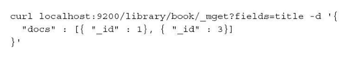
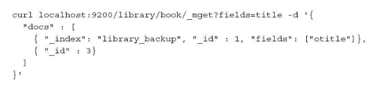
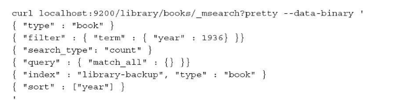
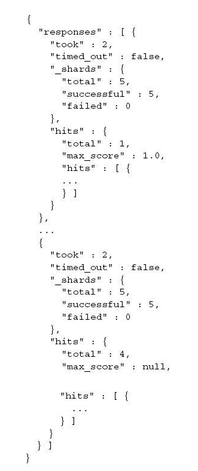

<!-- toc -->
<!-- more -->

> elasticsearch提供了批量操作来读取数据和检索
# 批量取
可以通过_mget端点操作，一个请求获取多个文档，elasticsearch会返回哪些被索引的文档，**而不论这些文档可用于搜索还是暂时对查询不可见**
查看下面的操作：

elasticsearch返回如下形式的文档：

前面的范例还可以写成如下的更紧凑的形式：

这种形式便于获取不同文档有不同目标索引及类型
我们来看下面这个查询：

该查询返回了id为1和3的两个文档，但是第一个文档从索引library_backup中获取，第二个文档则从索引library中获取（因为url中定义索引名为library，因此将它作为默认值），而且第一个文档我们限制只返回otitle字段

# 批量查询
允许用户将多个查询请求打包到一组，elasticsearch将输入解析成一行一行的文本，而文本行包含了目标索引、其他参数以及查询串等信息
范例：

查询请求被发送到_msearch端点，请求的偶数行复制携带真正的查询
结果：

**批量查询允许我们将多个独立的查询打包到一个请求中**
（注：内容整理自《深入理解Elasticsearch》）