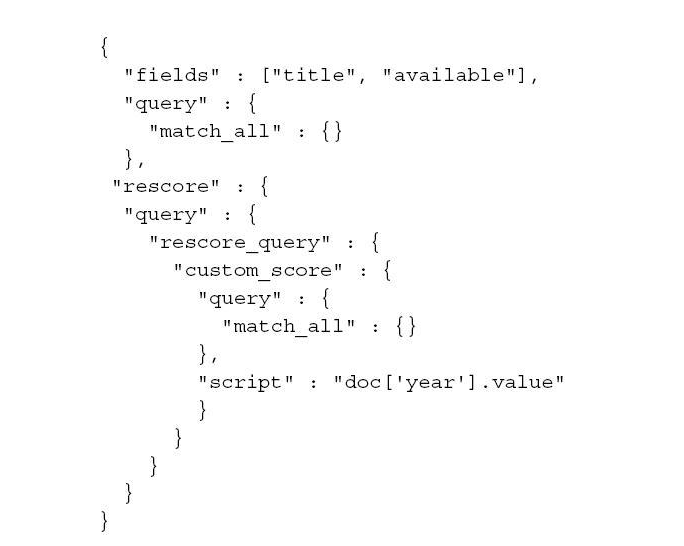
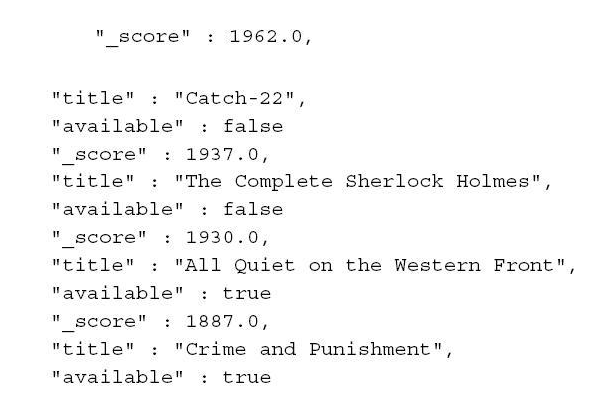

>二次评分给了用户很多机会来定制业务逻辑

<!-- more -->

# 理解二次评分
二次评分是指重新计算查询返回文档中**指定个数文档**的得分，es会截取查询返回的前N个，并使用预定义的二次评分方法来重新计算他们的得分

# 二次评分查询结构
从最简单的查询入手：match_all查询类型，返回索引中所有文档，每个返回的文档的得分都是1.0，这样可以充分体现二次评分对查询返回文档集的影响

查询范例如下：

改查询将每一个文档的得分改写为该文档的year字段中的值

返回结果：

# 二次评分参数配置
在resource对象中，必须配置下面的参数：
- **window_size** 窗口大小，默认值是from和size参数值之和，它指定了每个分片上参与二次评分的文档个数
- **query_weight** 查询权重，默认值是1，原始查询得分与二次评分的得分相加之前将乘以改值
- **rescore_query_weight** 二次评分查询的权重值，默认值是1，二次评分查询得分在与原始查询得分相加之前，乘以该值
- **rescore_mode** 二次评分模式，默认为total，可用的选项有total、max、min、avg和mutiply
    - total 得分是两种查询之he
    - max 两种查询中的最大值
    - min 两种查询中的最小值
    - avg 两种查询的平均值
    - multiply 两种查询的乘积

# 小结
1. 有时候，我们需要显示查询结果，并且使得页面上靠前文档的顺序能受到一些额外的规则控制，但遗憾的是，我们并不能通过二次评分来实现，**也许有些读者会想到window-size参数，然而实际上这个参数与返回列表中靠前文档并无关系，他只是制定了每个分片应该返回的文档数，而且window_size不能小于页面大小**
2. **二次评分功能并不能与排序一起使用**，这是因为排序发生在二次评分之前，所以排序没有考虑后续新计算出来的文档得分

（注：内容整理自《深入理解Elasticsearch》）