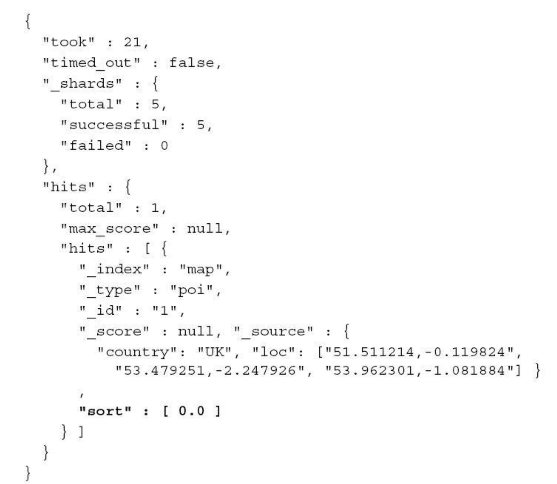

> 当你发送请求至elasticsearch,返回文档默认按文档得分降序排序，这是通常我们想要了，然而，有时候我们希望能改变这种排序方式

<!-- more -->

下面的例子就容易做到：

该查询会返回所有在title字段上至少命中一个词项的文档，并且基于section数据排序

**也可以通过添加查询sort部分的missing属性为那些section字段缺失的文档定制排序行为**

# 基于多值字段的排序
某些文档的release-dates字段里面储存了多个电影上映日期（同一部电影在不同国家的上映日期不同）我们可以构造查询请求：

例子中**es将基于每个文档的release_dates字段的最小值进行排序**
mode参数可以设置为以上值：
- min 按照该字段最小值排序
- max 按照该字段最大值进行排序
- avg 按照多个字段平均值排序
- sum 按照字段总和进行排序

后面两个选项只对数值类型有效

# 基于多值geo字段的排序
es提供了基于多维坐标系数据的排序，我们通过一个实例了解这种类型的排序
例如，要查找特点国家里离自己最近的一个机构
我们使用下面的这个映射：

查询如图：

查询结果：

我们可以看到，返回结果包含这个值：“sort”：[0.0]这是因为返回文档的地理坐标和查询中的坐标精确匹配
还可以设置mode属性为max，min，avg
例如avg代表：此时基于字段中的地理位置坐标与查询坐标的距离的均值排序

# 基于嵌套对象的排序
继续嵌套对象的排序，**对以下两种情形都适用**：
- 适用了显式嵌套映射(在映射中配置type=“nested”)的文档
- 使用了对象类型的文档
两者之间的一些细微区别需要注意
假设我们索引如下数据：

查询：

查询返回结果按照嵌套对象的usert字段最小值降序
如果将子文档视为一种数据类型，则可以将查询简化为如下形式：

当我们使用对象类型时，可以简化查询，这是因为整个对象结构被当成一个lucene文档进行储存
有些时候，使用**nested_path**属性会更加便捷
按照下面的方式构造查询：

我们也可以使用**nested_filter**参数，改参数只对嵌套文档有效，利用这个参数，我们可以在排序前就已经通过一个过滤器在检索期排除了某些文档，而不是检索结果文档集中过滤它们
（注：内容整理自《深入理解Elasticsearch》）