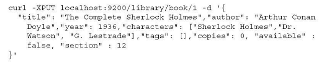
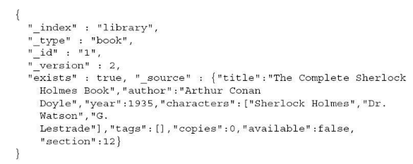
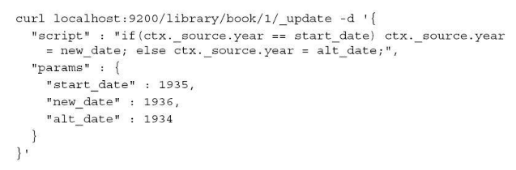
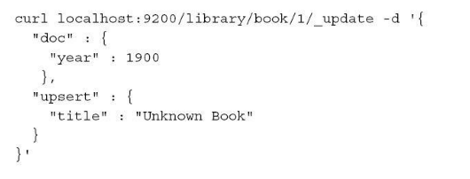
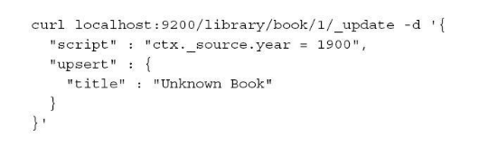
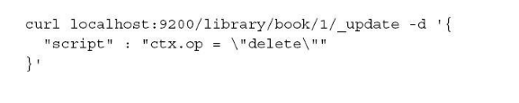

<!-- toc -->
<!-- more -->

> 
- 简单字段更新
- 使用脚本按条件更新
- 使用更新api创建或删除文档

# 为什么我们无法真的更新索引中的文档
在索引一个新文档的时候，lucene会对每个字段进行分析并产生词条流，词条流中的词条可以会经过过滤器的额外处理，而没有过滤掉的词条会写入倒排索引中，索引过程中，一些不需要的信息可能被抛弃，这些信息包括：
- 某些特殊的词条位置（当词向量没有储存时）
- 特定词汇（停用词或同义词）
- 词条的变形（如词干还原）

因此我们无法更新索引中的文档，而且每次修改时不得不向索引发送文档所有字段数据

# _source
elasticsearch可以通过使用**_source**伪字段储存和检索文档的原始数据来解决这个问题，当用户需要更改文档时，elasticsearch会获取**_soucre**字段中的值，做相应的修改，然后向索引提交一个新文档，替换老文档

为了使得这个特征起效,**_source**字段必须是可用的

# 局限
更新命令的一个很大的局限就是它只能更新单个文档，目前还不支持通过查询实现批量更新

# 更新api
文档更新可以通过执行发送至端点的更新请求来实现，也可以通过在更新请求的url中添加_update参数来更新某个特定的文档

比如 /library/book/_update

本文其余部分都将使用下面命令索引的文档：

## 简单字段更新
使用下面命令

    curl -XPOST localhost:9200/library/book/1/_update -d'{
        "doc":{
            "title":"The Complete Sherlock Homes Book"
            "year":1935
        }
    }
    
作为响应，elasticsearch将返回一个与建索引操作类似的回复：

    {"ok":true,"_index":"library","_type":"book","_id":"1","_version"2}
    
现在，如果我们想从索引获取刚才修改的文档是否被修改了，可以执行下面的命令：

    curl -xGET localhost:9200/library/book/1?pretty
    
改命令响应如下：

可以看到_source字段中的值已经被修改了

## 使用脚本按条件更新
有时候在修改文档的时候添加一些额外的逻辑是很有好处的
例如我们发送下面的请求：

ctx变量来引用源文档

## 使用更新api创建或删除文档
更新api不仅仅可以修改文档，也可以用来操作整个文档

**upsert**属性允许用户在当url中地址不存在时创建一个新文档
查看下面命令：

该命令修改了某个已有的文档year字段，如果文档不存在，将会创建一个文档，并且该文档会创建一个新字段title

前面的命令还可以使用脚本重写为以下形式

有条件的移除整个文档：

（注：内容整理自《深入理解Elasticsearch》）
