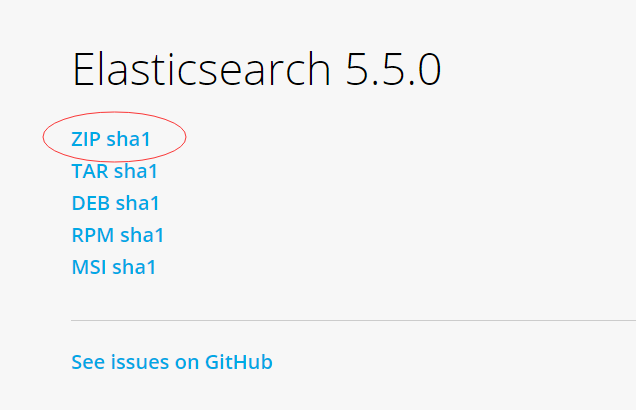

<span/>
<!-- more -->

<!-- toc -->
# 1.环境与准备工作
1. WINDOWS 10
2. IDEA 17.2
3. JDK 1.8.0_141
4. Gradle 4.0.1

# 2.获取代码
gitlab地址：
[elasticsearch](https://github.com/elastic/elasticsearch)


复制到sourcetree中，tag选择 v5.5.0

如果不使用sourcetree可以使用git命令操作
```xml
git checkout v5.5.0
```

# 3.编译代码
到代码根目录 elasticsearch下面运行：
```xml
gradle idea
```
等待漫长的依赖下载过程后，运行：
```xml
gradle build -x test
```
对源码进行编译

# 4.idea打开项目


配置好gradle的文件地址，其他的直接使用默认设置，直接next

文件结构是这样的：


# 5.启动main函数
打开类：org.elasticsearch.bootstrap.Elasticsearch
运行里面的main函数
需要添加一些启动参数：


**-Des.path.home**
指定es的目录地址，elasticsearch在启动中会加载一些默认配置以及插件,我们直接加载elasticsearch安装目录下的配置和插件即可

如果不配置会报错：
Exception in thread “main” java.lang.IllegalStateException: path.home is not configured

**-Dlog4j2.disable.jmx=true**
为elasticsearch在启动过程中使用到了jmx,我们这里禁止使用即可

如果不配置会报错：
main ERROR Could not register mbeans java.security.AccessControlException: access denied (“javax.management.MBeanTrustPermission” “register”)

**注意**
1. 如果报错没有找到config
2. 如果报错没有找到 plugins
3. 如果报错：java.lang.IllegalStateException: Unsupported transport.type []

解决方案：去官网下个zip包：
https://www.elastic.co/downloads/elasticsearch

解压后把里面config、modules、plugins 复制到elasticsearch/core里面

# 6.运行main方法
控制台看到如下说明启动成功


# 7.浏览器访问
http://localhost:9200


