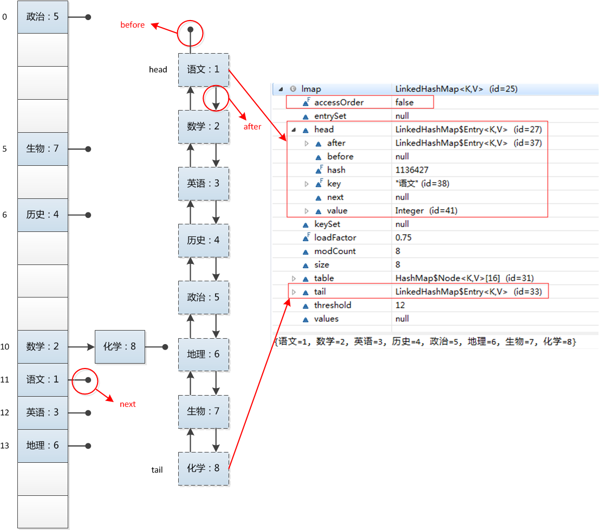

<span/>
<!-- more -->

<!-- toc -->
# 概述
- HashMap 是无序的，HashMap 在 put 的时候是根据 key 的 hashcode 进行 hash 然后放入对应的地方。所以遍历 HashMap 的顺序跟 put 的顺序不同

- JAVA 在 JDK1.4 以后提供了 LinkedHashMap 来帮助我们实现了有序的 HashMap

- **LinkedHashMap 是 HashMap的一个子类**，它保留了元素插入的顺序，如果需要输出的顺序和输入时的相同，那么就选用 LinkedHashMap。

- LinkedHashMap允许使用 null 值和 null 键

- LinkedHashMap 实现与 HashMap 的不同之处在于，**LinkedHashMap 维护着一个运行于所有条目的双重链接列表。此链接列表定义了迭代顺序，该迭代顺序可以是插入顺序或者是访问顺序**。

- 根据链表中元素的顺序可以分为：**按插入顺序的链表**，和**按访问顺序(调用 get 方法)的链表**。**默认是按插入顺序排序**，**如果指定按访问顺序排序，那么调用get方法后，会将这次访问的元素移至链表尾部**，不断访问可以形成按访问顺序排序的链表。

# 例子
## HashMap
```java
public static void main(String[] args) {
    Map<String, String> map = new HashMap<String, String>();
    map.put("apple", "苹果");
    map.put("watermelon", "西瓜");
    map.put("banana", "香蕉");
    map.put("peach", "桃子");

    Iterator iter = map.entrySet().iterator();
    while (iter.hasNext()) {
        Map.Entry entry = (Map.Entry) iter.next();
        System.out.println(entry.getKey() + "=" + entry.getValue());
    }
}
```
输出：
> banana=香蕉
apple=苹果
peach=桃子
watermelon=西瓜

可以发现，遍历HashMap 是没有顺序的

## LinkedHashMap
```java
public static void main(String[] args) {
    Map<String, String> map = new LinkedHashMap<String, String>();
    map.put("apple", "苹果");
    map.put("watermelon", "西瓜");
    map.put("banana", "香蕉");
    map.put("peach", "桃子");

    Iterator iter = map.entrySet().iterator();
    while (iter.hasNext()) {
        Map.Entry entry = (Map.Entry) iter.next();
        System.out.println(entry.getKey() + "=" + entry.getValue());
    }
}
```
输出：
> apple=苹果
watermelon=西瓜
banana=香蕉
peach=桃子

可以发现，其输出顺序是完成按照插入顺序的！也就是我们上面所说的保留了插入的顺序

接下来验证按照访问顺序
```java
public static void main(String[] args) {
    Map<String, String> map = new LinkedHashMap<String, String>(16,0.75f,true);
    map.put("apple", "苹果");
    map.put("watermelon", "西瓜");
    map.put("banana", "香蕉");
    map.put("peach", "桃子");

    map.get("banana");
    map.get("apple");

    Iterator iter = map.entrySet().iterator();
    while (iter.hasNext()) {
        Map.Entry entry = (Map.Entry) iter.next();
        System.out.println(entry.getKey() + "=" + entry.getValue());
    }
}
```
输出：
> watermelon=西瓜
peach=桃子
banana=香蕉
apple=苹果

可以发现，访问了banana和apple之后，遍历，他们排在了后面

再来看一个例子：
```java
LinkedHashMap<String, Integer> lmap = new LinkedHashMap<String, Integer>();
lmap.put("语文", 1);
lmap.put("数学", 2);
lmap.put("英语", 3);
lmap.put("历史", 4);
lmap.put("政治", 5);
lmap.put("地理", 6);
lmap.put("生物", 7);
lmap.put("化学", 8);
for(Entry<String, Integer> entry : lmap.entrySet()) {
    System.out.println(entry.getKey() + ": " + entry.getValue());
}
```
输出：
> 语文: 1
数学: 2
英语: 3
历史: 4
政治: 5
地理: 6
生物: 7
化学: 8

我们来看看LinkedHashMap的内部结构：


看图应该很清楚了，**LinkedHashMap是Hash表和链表的实现，并且依靠着双向链表保证了迭代顺序是插入的顺序。**


# 实现
对于 LinkedHashMap 而言，它继承与 HashMap(public class LinkedHashMap<K,V> extends HashMap<K,V> implements Map<K,V>)、底层使用哈希表与双向链表来保存所有元素。**其基本操作与父类 HashMap 相似，它通过重写父类相关的方法，来实现自己的链接列表特性**。下面我们来分析 LinkedHashMap 的源代码：

在HashMap中提到了下面的定义：
```java
// Callbacks to allow LinkedHashMap post-actions
void afterNodeAccess(Node<K,V> p) { }
void afterNodeInsertion(boolean evict) { }
void afterNodeRemoval(Node<K,V> p) { }
```
LinkedHashMap继承于HashMap，因此也重新实现了这3个函数，顾名思义这三个函数的作用分别是：**节点访问后、节点插入后、节点移除后**做一些事情。

afterNodeAccess函数:
```java
void afterNodeAccess(Node<K,V> e) { // move node to last
    LinkedHashMap.Entry<K,V> last;
    // 如果定义了accessOrder，那么就保证最近访问节点放到最后
    if (accessOrder && (last = tail) != e) {
        LinkedHashMap.Entry<K,V> p =
            (LinkedHashMap.Entry<K,V>)e, b = p.before, a = p.after;
        p.after = null;
        if (b == null)
            head = a;
        else
            b.after = a;
        if (a != null)
            a.before = b;
        else
            last = b;
        if (last == null)
            head = p;
        else {
            p.before = last;
            last.after = p;
        }
        tail = p;
        ++modCount;
    }
}
```

就是说在进行put之后就算是对节点的访问了，那么这个时候就会更新链表，把最近访问的放到最后

afterNodeInsertion函数
```java
void afterNodeInsertion(boolean evict) { // possibly remove eldest
    LinkedHashMap.Entry<K,V> first;
    // 如果定义了移除规则，则执行相应的溢出
    if (evict && (first = head) != null && removeEldestEntry(first)) {
        K key = first.key;
        removeNode(hash(key), key, null, false, true);
    }
}
```


## 成员变量
LinkedHashMap 采用的 hash 算法和 HashMap 相同，但是它重新定义了数组中保存的元素 Entry，该 Entry 除了保存当前对象的引用外，**还保存了其上一个元素 before 和下一个元素 after 的引用**，从而在哈希表的基础上又构成了双向链接列表。看源代码：
```java
/**
* The iteration ordering method for this linked hash map: <tt>true</tt>
* for access-order, <tt>false</tt> for insertion-order.
* 如果为true，则按照访问顺序；如果为false，则按照插入顺序。
*/
private final boolean accessOrder;
/**
* 双向链表的表头元素。
 */
private transient Entry<K,V> header;

/**
* LinkedHashMap的Entry元素。
* 继承HashMap的Entry元素，又保存了其上一个元素before和下一个元素after的引用。
 */
private static class Entry<K,V> extends HashMap.Entry<K,V> {
    Entry<K,V> before, after;
    ……
}
```
LinkedHashMap 中的 Entry 集成于 HashMap 的 Entry，但是其增加了 before 和 after 的引用，指的是上一个元素和下一个元素的引用。

## 初始化
通过源代码可以看出，在 LinkedHashMap 的构造方法中，实际调用了父类 HashMap 的相关构造方法来构造一个底层存放的 table 数组，**但额外可以增加 accessOrder 这个参数，如果不设置，默认为 false，代表按照插入顺序进行迭代；当然可以显式设置为 true，代表以访问顺序进行迭代**。如：
```java
public LinkedHashMap(int initialCapacity, float loadFactor,boolean accessOrder) {
    super(initialCapacity, loadFactor);
    this.accessOrder = accessOrder;
}
```
我们已经知道 LinkedHashMap 的 Entry 元素继承 HashMap 的 Entry，提供了双向链表的功能。在上述 HashMap 的构造器中，**最后会调用 init() 方法，进行相关的初始化**，这个方法在 HashMap 的实现中并无意义，只是提供给子类实现相关的初始化调用。
**但在 LinkedHashMap 重写了 init() 方法，在调用父类的构造方法完成构造后，进一步实现了对其元素 Entry 的初始化操作。**
```java
/**
* Called by superclass constructors and pseudoconstructors (clone,
* readObject) before any entries are inserted into the map.  Initializes
* the chain.
*/
@Override
void init() {
  header = new Entry<>(-1, null, null, null);
  header.before = header.after = header;
}
```
## 储存
LinkedHashMap 并未重写父类 HashMap 的 put 方法，而是重写了父类 HashMap 的 put 方法调用的子方法**void recordAccess(HashMap m) ，void addEntry(int hash, K key, V value, int bucketIndex) 和void createEntry(int hash, K key, V value, int bucketIndex)**，提供了自己特有的双向链接列表的实现。我们在之前的文章中已经讲解了HashMap的put方法，我们在这里重新贴一下 HashMap 的 put 方法的源代码：
```java
public V put(K key, V value) {
        if (key == null)
            return putForNullKey(value);
        int hash = hash(key);
        int i = indexFor(hash, table.length);
        for (Entry<K,V> e = table[i]; e != null; e = e.next) {
            Object k;
            if (e.hash == hash && ((k = e.key) == key || key.equals(k))) {
                V oldValue = e.value;
                e.value = value;
                e.recordAccess(this);
                return oldValue;
            }
        }

        modCount++;
        addEntry(hash, key, value, i);
        return null;
}
```
重写的方法：
```java
void recordAccess(HashMap<K,V> m) {
    LinkedHashMap<K,V> lm = (LinkedHashMap<K,V>)m;
    if (lm.accessOrder) {
        lm.modCount++;
        remove();
        addBefore(lm.header);
        }
}

void addEntry(int hash, K key, V value, int bucketIndex) {
    // 调用create方法，将新元素以双向链表的的形式加入到映射中。
    createEntry(hash, key, value, bucketIndex);

    // 删除最近最少使用元素的策略定义
    Entry<K,V> eldest = header.after;
    if (removeEldestEntry(eldest)) {
        removeEntryForKey(eldest.key);
    } else {
        if (size >= threshold)
            resize(2 * table.length);
    }
}

void createEntry(int hash, K key, V value, int bucketIndex) {
    HashMap.Entry<K,V> old = table[bucketIndex];
    Entry<K,V> e = new Entry<K,V>(hash, key, value, old);
    table[bucketIndex] = e;
    // 调用元素的addBrefore方法，将元素加入到哈希、双向链接列表。  
    e.addBefore(header);
    size++;
}

private void addBefore(Entry<K,V> existingEntry) {
    after  = existingEntry;
    before = existingEntry.before;
    before.after = this;
    after.before = this;
}
```

## 读取
LinkedHashMap 重写了父类 HashMap 的 get 方法，**实际在调用父类 getEntry() 方法取得查找的元素后，再判断当排序模式 accessOrder 为 true 时，记录访问顺序，将最新访问的元素添加到双向链表的表头，并从原来的位置删除。**由于的链表的增加、删除操作是常量级的，故并不会带来性能的损失。
```java
public V get(Object key) {
    // 调用父类HashMap的getEntry()方法，取得要查找的元素。
    Entry<K,V> e = (Entry<K,V>)getEntry(key);
    if (e == null)
        return null;
    // 记录访问顺序。
    e.recordAccess(this);
    return e.value;
}

void recordAccess(HashMap<K,V> m) {
    LinkedHashMap<K,V> lm = (LinkedHashMap<K,V>)m;
    // 如果定义了LinkedHashMap的迭代顺序为访问顺序，
    // 则删除以前位置上的元素，并将最新访问的元素添加到链表表头。  
    if (lm.accessOrder) {
        lm.modCount++;
        remove();
        addBefore(lm.header);
    }
}

/**
* Removes this entry from the linked list.
*/
private void remove() {
    before.after = after;
    after.before = before;
}

/**clear链表，设置header为初始状态*/
public void clear() {
 super.clear();
 header.before = header.after = header;
}
```

# 排序模式
LinkedHashMap 定义了排序模式 **accessOrder，该属性为 boolean 型变量，对于访问顺序，为 true；对于插入顺序，则为 false。一般情况下，不必指定排序模式，其迭代顺序即为默认为插入顺序**。

这些构造方法都会默认指定排序模式为插入顺序。如果你想构造一个 LinkedHashMap，**并打算按从近期访问最少到近期访问最多的顺序（即访问顺序）来保存元素，那么请使用下面的构造方法构造 LinkedHashMap：public LinkedHashMap(int initialCapacity, float loadFactor, boolean accessOrder)**

该哈希映射的迭代顺序就是最后访问其条目的顺序**，这种映射很适合构建 LRU 缓存**。LinkedHashMap 提供了 removeEldestEntry(Map.Entry<K,V> eldest) 方法。**该方法可以提供在每次添加新条目时移除最旧条目的实现程序，默认返回 false，这样，此映射的行为将类似于正常映射，即永远不能移除最旧的元素。**


# 对比下几种Map
java为数据结构中的映射定义了一个接口java.util.Map;它有四个实现类,分别是**HashMap Hashtable LinkedHashMap 和TreeMap.**

Map主要用于存储健值对，根据键得到值，因此不允许键重复(重复了覆盖了),但允许值重复。

## HashMap
Hashmap 是一个最常用的Map,它根据键的HashCode值存储数据,根据键可以直接获取它的值，具有很快的访问速度，遍历时，**取得数据的顺序是完全随机的**。 **HashMap最多只允许一条记录的键为Null;允许多条记录的值为 Null**;**HashMap不支持线程的同步**，即任一时刻可以有多个线程同时写HashMap;可能会导致数据的不一致。如果需要同步，可以用 Collections的synchronizedMap方法使HashMap具有同步的能力，或者使用ConcurrentHashMap。
## Hashtable
Hashtable与 HashMap类似,它继承自Dictionary类，不同的是:**它不允许记录的键或者值为空;它支持线程的同步**，即任一时刻只有一个线程能写Hashtable,因此也导致了 Hashtable在写入时会比较慢。
## LinkedHashMap
LinkedHashMap 是HashMap的一个子类，保存了记录的插入顺序，在用Iterator遍历LinkedHashMap时，先得到的记录肯定是先插入的.也可以在构造时用带参数，按照应用次数排序。在遍历的时候会比HashMap慢，不过有种情况例外，当HashMap容量很大，实际数据较少时，遍历起来可能会比 LinkedHashMap慢，因为LinkedHashMap的遍历速度只和实际数据有关，和容量无关，而HashMap的遍历速度和他的容量有关。
## TreeMap
TreeMap实现SortMap接口，**能够把它保存的记录根据键排序,默认是按键值的升序排序，也可以指定排序的比较器**，当用Iterator 遍历TreeMap时，得到的记录是排过序的。

# 总结
**其实 LinkedHashMap 几乎和 HashMap 一样**：从技术上来说，不同的是它定义了一个 Entry<K,V> header，这个 header 不是放在 Table 里，**它是额外独立出来的**。LinkedHashMap 通过继承 hashMap 中的 Entry<K,V>,并添加两个属性 Entry<K,V> before,after,和 header **结合起来组成一个双向链表，来实现按插入顺序或访问顺序排序**。


参考：
- http://wiki.jikexueyuan.com/project/java-collection/linkedhashmap.html
- https://yikun.github.io/2015/04/02/Java-LinkedHashMap%E5%B7%A5%E4%BD%9C%E5%8E%9F%E7%90%86%E5%8F%8A%E5%AE%9E%E7%8E%B0/
- http://www.cnblogs.com/hubingxu/archive/2012/02/21/2361281.html


