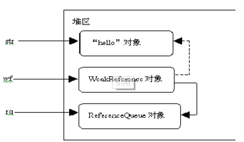
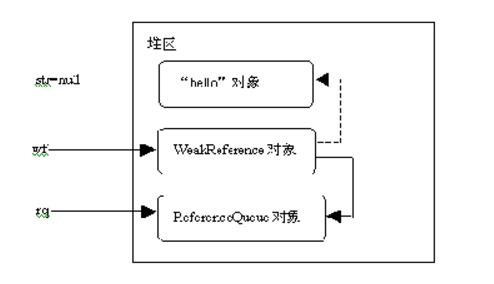

<!-- toc -->
<!-- more -->


> 在JDK 1.2以前的版本中，若一个对象不被任何变量引用，那么程序就无法再使用这个对象。也就是说，只有对象处于可触及（reachable）状态，程序才能使用它。从JDK 1.2版本开始，把对象的引用分为4种级别，从而使程序能更加灵活地控制对象的生命周期。这4种级别由高到低依次为：**强引用、软引用、弱引用和虚引用**。

# 强引用（StrongReference）
强引用是使用最普遍的引用。如果一个对象具有强引用，那垃圾回收器绝不会回收它。**当内存空间不足，Java虚拟机宁愿抛出OutOfMemoryError错误，使程序异常终止，也不会靠随意回收具有强引用的对象来解决内存不足的问题**  ps：强引用其实也就是我们平时A a = new A()这个意思。

## 代码
```java
@Test  
public void strongReference() {  
    Object referent = new Object();  
      
    /** 
     * 通过赋值创建 StrongReference  
     */  
    Object strongReference = referent;  
      
    assertSame(referent, strongReference);  
      
    referent = null;  
    System.gc();  
      
    /** 
     * StrongReference 在 GC 后不会被回收 
     */  
    assertNotNull(strongReference);  
}  
```

# 软引用（SoftReference）
**如果一个对象只具有软引用，则内存空间足够，垃圾回收器就不会回收它；如果内存空间不足了，就会回收这些对象的内存**。只要垃圾回收器没有回收它，该对象就可以被程序使用。软引用可用来实现内存敏感的高速缓存（下文给出示例）。
软引用可以和一个引用队列（ReferenceQueue）联合使用，如果软引用所引用的对象被垃圾回收器回收，Java虚拟机就会把这个软引用加入到与之关联的引用队列中。

## 为什么需要使用软引用
我们知道，访问磁盘文件、访问网络资源、查询数据库等操作都是影响应用程序执行性能的重要因素，如果能重新获取那些尚未被回收的Java对象的引用，必将减少不必要的访问，大大提高程序的运行速度。

## 代码
```java
@Test  
public void softReference() {  
    Object referent = new Object();  
    SoftReference<Object> softRerference = new SoftReference<Object>(referent);  
  
    assertNotNull(softRerference.get());  
      
    referent = null;  
    System.gc();  
      
    /** 
     *  soft references 只有在 jvm OutOfMemory 之前才会被回收, 所以它非常适合缓存应用 
     */  
    assertNotNull(softRerference.get());  
}  
```

以下程序创建了一个String对象、ReferenceQueue对象和WeakReference对象：
```java
//创建一个强引用
String str = new String("hello");
//创建引用队列, <String>为范型标记，表明队列中存放String对象的引用
ReferenceQueue<String> rq = new ReferenceQueue<String>();
//创建一个弱引用，它引用"hello"对象，并且与rq引用队列关联
//<String>为范型标记，表明WeakReference会弱引用String对象
WeakReference<String> wf = new WeakReference<String>(str, rq);
```

以上程序代码执行完毕，内存中引用与对象的关系如图所示，"hello"对象同时具有强引用和弱引用：`

带实线的箭头表示强引用，带虚线的箭头表示弱引用。从图中可以看出，此时"hello"对象被str强引用，并且被一个WeakReference对象弱引用，因此"hello"对象不会被垃圾回收。

在以下程序代码中，把引用"hello"对象的str变量置为null，然后再通过WeakReference弱引用的get()方法获得"hello"对象的引用：

```java
String str = new String("hello"); //① 
ReferenceQueue<String> rq = new ReferenceQueue<String>(); //② 
WeakReference<String> wf = new WeakReference<String>(str, rq); //③
str=null; //④取消"hello"对象的强引用
String str1=wf.get(); //⑤假如"hello"对象没有被回收，str1引用"hello"对象
//假如"hello"对象没有被回收，rq.poll()返回null
Reference<? extends String> ref=rq.poll(); //⑥
```
执行完以上第④行后，内存中引用与对象的关系下图所示：


此时"hello"对象仅仅具有弱引用，因此它有可能被垃圾回收。假如它还没有被垃圾回收，那么接下来在第⑤行执行wf.get()方法会返回 "hello"对象的引用，并且使得这个对象被str1强引用。再接下来在第⑥行执行rq.poll()方法会返回null，因为此时引用队列中没有任何 引用。ReferenceQueue的poll()方法用于返回队列中的引用，如果没有则返回null。

，在以下程序代码中，执行完第④行后，"hello"对象仅仅具有弱引用。接下来两次调用System.gc()方法，催促垃圾回收器工作，从而提高 "hello"对象被回收的可能性。假如"hello"对象被回收，那么WeakReference对象的引用被加入到ReferenceQueue中， 接下来wf.get()方法返回null，并且rq.poll()方法返回WeakReference对象的引用。

```java
String str = new String("hello"); //①
ReferenceQueue<String> rq = new ReferenceQueue<String>(); //② 
WeakReference<String> wf = new WeakReference<String>(str, rq); //③
str=null; //④
//两次催促垃圾回收器工作，提高"hello"对象被回收的可能性
System.gc(); //⑤
System.gc(); //⑥
String str1=wf.get(); //⑦ 假如"hello"对象被回收，str1为null
Reference<? extends String> ref=rq.poll(); //⑧
```

# 弱引用（WeakReference）
弱引用与软引用的区别在于：只具有弱引用的对象拥有更短暂的生命周期。在垃圾回收器线程扫描它所管辖的内存区域的过程中，一旦发现了只具有弱引用的对象，**不管当前内存空间足够与否，都会回收它的内存**。不过，由于垃圾回收器是一个优先级很低的线程，因此不一定会很快发现那些只具有弱引用的对象。
弱引用可以和一个引用队列（ReferenceQueue）联合使用，如果弱引用所引用的对象被垃圾回收，Java虚拟机就会把这个弱引用加入到与之关联的引用队列中。

## 代码
```java
@Test  
public void weakReference() {  
    Object referent = new Object();  
    WeakReference<Object> weakRerference = new WeakReference<Object>(referent);  
  
    assertSame(referent, weakRerference.get());  
      
    referent = null;  
    System.gc();  
      
    /** 
     * 一旦没有指向 referent 的强引用, weak reference 在 GC 后会被自动回收 
     */  
    assertNull(weakRerference.get());  
}  
```

# 虚引用（PhantomReference）
“虚引用”顾名思义，就是形同虚设，与其他几种引用都不同**，虚引用并不会决定对象的生命周期。如果一个对象仅持有虚引用，那么它就和没有任何引用一样，在任何时候都可能被垃圾回收器回收**
虚引用主要用来跟踪对象被垃圾回收器回收的活动。虚引用与软引用和弱引用的一个区别在于：虚引用必须和引用队列 （ReferenceQueue）联合使用。当垃圾回收器准备回收一个对象时，如果发现它还有虚引用，就会在回收对象的内存之前，把这个虚引用加入到与之 关联的引用队列中。
ReferenceQueue queue = new ReferenceQueue ();
PhantomReference pr = new PhantomReference (object, queue); 
程序可以通过判断引用队列中是否已经加入了虚引用，来了解被引用的对象是否将要被垃圾回收。如果程序发现某个虚引用已经被加入到引用队列，那么就可以在所引用的对象的内存被回收之前采取必要的行动。

## 代码
```java
@Test  
public void phantomReferenceAlwaysNull() {  
    Object referent = new Object();  
    PhantomReference<Object> phantomReference = new PhantomReference<Object>(referent, new ReferenceQueue<Object>());  
      
    /** 
     * phantom reference 的 get 方法永远返回 null  
     */  
    assertNull(phantomReference.get());  
}  
```
参考：
- http://blog.csdn.net/mxbhxx/article/details/9111711
- http://blog.csdn.net/u011936381/article/details/11709245
- https://www.dexcoder.com/selfly/article/313