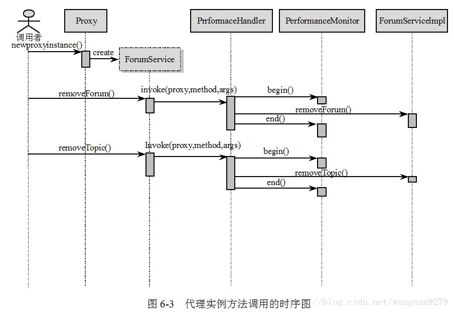

<!-- toc -->
<!-- more -->

> spring AOP使用动态代理技术在运行期织入增强的代码，为了揭示Spring AOP底层的工作机理，有必要对涉及到的Java知识进行学习。Spring AOP使用了两种代理机制：一种是基于JDK的动态代理；另一种是基于CGLib的动态代理。之所以需要两种代理机制，很大程度上是因为JDK本身只提供接口的代理，而不支持类的代理。

> http://www.iteye.com/topic/1123293
 
# 带有横切逻辑的实例

我们通过具体化代码实现上一节所介绍例子的性能监视横切逻辑，并通过动态代理技术对此进行改造。在调用每一个目标类方法时启动方法的性能监视，在目标类方法调用完成时记录方法的花费时间。

代码清单 ForumService.java和ForumServiceImpl.java：包含性能监视横切代码

```java
package proxyTest;

public interface ForumService {

    void removeForum(int i);

    void removeTopic(int i);

}
```
```java
package proxyTest;

public class ForumServiceImpl implements ForumService {
    public void removeTopic(int topicId) {

        // ①-1开始对该方法进行性能监视
        PerformanceMonitor.begin("ForumServiceImpl. removeTopic");
        System.out.println("模拟删除Topic记录:" + topicId);
        try {
            Thread.currentThread();
            Thread.sleep(20);
        } catch (Exception e) {
            throw new RuntimeException(e);
        }

        // ①-2结束对该方法进行性能监视
        PerformanceMonitor.end();
    }

    public void removeForum(int forumId) {
        // ②-1开始对该方法进行性能监视
        PerformanceMonitor.begin("ForumServiceImpl. removeForum");
        System.out.println("模拟删除Forum记录:" + forumId);
        try {
            Thread.currentThread();
            Thread.sleep(40);
        } catch (Exception e) {
            throw new RuntimeException(e);
        }

        // ②-2结束对该方法进行性能监视
        PerformanceMonitor.end();
    }
}
```
代码清单中粗体表示的代码就是具有横切逻辑特征的代码，每个Service类和每个业务方法体的前后都执行相同的代码逻辑：方法调用前启动PerformanceMonitor，方法调用后通知PerformanceMonitor结束性能监视并给记录性能监视结果。

PerformanceMonitor是性能监视的实现类，我们给出一个非常简单的实现版本，其代码如代码清单所示：

代码清单 PerformanceMonitor.java
```java
package proxyTest;

public class PerformanceMonitor {
    //①通过一个ThreadLocal保存调用线程相关的性能监视信息  
    private static ThreadLocal<MethodPerformance> performanceRecord =          
                                new ThreadLocal<MethodPerformance>();  

    //②启动对某一目标方法的性能监视  
     public static void begin(String method) {  
        System.out.println("begin monitor...");  
        MethodPerformance mp = new MethodPerformance(method);  
        performanceRecord.set(mp);  
    }  
    public static void end() {  
        System.out.println("end monitor...");  
        MethodPerformance mp = performanceRecord.get();  

         //③打印出方法性能监视的结果信息。  
        mp.printPerformance();  
    }  

}
```
ThreadLocal是将非线程安全类改造为线程安全类的法宝，在9.2节中我们将详细介绍这个Java基础知识。PerformanceMonitor提供了两个方法：通过调用begin(String method)方法开始对某个目标类方法的监视，method为目标类方法的全限定名；而end()方法结束对目标类方法的监视，并给出性能监视的信息。这两个方法必须配套使用。

用于记录性能监视信息的MethodPerformance类的代码如所示：

代码清单 MethodPerformance.java
```java
package proxyTest;

public class MethodPerformance {
    private long begin;  
    private long end;  
    private String serviceMethod;  
    public MethodPerformance(String serviceMethod){  
       this.serviceMethod = serviceMethod;  

       //①记录目标类方法开始执行点的系统时间    
       this.begin = System.currentTimeMillis();   

    }  
    public void printPerformance(){  

        //②获取目标类方法执行完成后的系统时间，并进而计算出目标类方法执行时间  
        end = System.currentTimeMillis();   
        long elapse = end - begin;  

        //③报告目标类方法的执行时间  
        System.out.println(serviceMethod+"花费"+elapse+"毫秒。");    
    }  

}
```
通过下面的代码测试拥有性能监视能力的ForumServiceImpl业务方法：
```java
package proxyTest;

public class TestForumService {
    public static void main(String[] args) {
        ForumService forumService = new ForumServiceImpl();
        forumService.removeForum(10);
        forumService.removeTopic(1012);
    }

}
```
我们得到以下输出信息：
> begin monitor... ①removeForum(10)方法的性能监视报告 
模拟删除Forum记录:10 
end monitor... 
com.baobaotao.proxy.ForumServiceImpl.removeForum花费47毫秒。 
begin monitor... ①removeTopic(1012)方法的性能监视报告 
模拟删除Topic记录:1012 
end monitor... 
com.baobaotao.proxy.ForumServiceImpl.removeTopic花费26毫秒。

正如代码清单实例所示，当某个方法需要进行性能监视，就必须调整方法代码，在方法体前后分别添加上开启性能监视和结束性能监视的代码。这些非业务逻辑的性能监视代码破坏了ForumServiceImpl业务逻辑的纯粹性。我们希望通过代理的方式，将业务类方法中开启和结束性能监视的这些横切代码从业务类中完全移除。并通过JDK动态代理技术或CGLib动态代理技术将横切代码动态织入到目标方法的相应位置。

# JDK动态代理
JDK 1.3以后，Java提供了动态代理的技术，允许开发者在运行期创建接口的代理实例。在Sun刚推出动态代理时，还很难想象它有多大的实际用途，现在我们终于发现动态代理是实现AOP的绝好底层技术。

JDK的动态代理主要涉及到java.lang.reflect包中的两个类：Proxy和InvocationHandler。其中InvocationHandler是一个接口，可以通过实现该接口定义横切逻辑，并通过反射机制调用目标类的代码，动态将横切逻辑和业务逻辑编织在一起。

而Proxy利用InvocationHandler动态创建一个符合某一接口的实例，生成目标类的代理对象。这样讲一定很抽象，我们马上着手使用Proxy和InvocationHandler这两个魔法戒对上一节中的性能监视代码进行革新。

首先，我们从业务类ForumServiceImpl中删除性能监视的横切代码，使ForumServiceImpl只负责具体的业务逻辑，如代码清单6-5所示：

代码清单6-5 ForumServiceImpl：移除性能监视横切代码

```java
package proxyTest;

public class ForumServiceImpl implements ForumService {
    public void removeTopic(int topicId) {

        System.out.println("模拟删除Topic记录:" + topicId);
        try {
            Thread.currentThread();
            Thread.sleep(20);
        } catch (Exception e) {
            throw new RuntimeException(e);
        }

    }
    public void removeForum(int forumId) {

        System.out.println("模拟删除Forum记录:" + forumId);
        try {
            Thread.currentThread();
            Thread.sleep(40);
        } catch (Exception e) {
            throw new RuntimeException(e);
        }

    }
}
```

在代码清单中的①和②处，原来的性能监视代码被移除了，我们只保留了真正的业务逻辑。

从业务类中移除的性能监视横切代码当然不能漂浮在空气中，它还得找到一个安身之所，InvocationHandler就是横切代码的安家乐园，我们将性能监视的代码安置在PerformanceHandler中，如代码清单所示：

```java
package proxyTest;
import java.lang.reflect.InvocationHandler;
import java.lang.reflect.Method;
public class PerformanceHandler implements InvocationHandler {
    private Object target;
    public PerformanceHandler(Object target) { // ②target为目标的业务类
        this.target = target;
    }
    public Object invoke(Object proxy, Method method, Object[] args)
            throws Throwable {
        PerformanceMonitor.begin(target.getClass().getName() + "."
                + method.getName());
        Object obj = method.invoke(target, args);// ③-2通过反射方法调用业务类的目标方法
        PerformanceMonitor.end();
        return obj;
    }

}
```
③处invoke()方法中粗体所示部分的代码为性能监视的横切代码，我们发现，横切代码只出现一次，而不是原来那样星洒各处。③-2处的method.invoke()语句通过Java反射机制间接调用目标对象的方法，这样InvocationHandler的invoke()方法就将横切逻辑代码（③-1）和业务类方法的业务逻辑代码（③-2）编织到一起了，所以我们可以将InvocationHandler看成是一个编织器。下面，我们对这段代码做进一步的说明。

首先，我们实现InvocationHandler接口，该接口定义了一个 invoke(Object proxy, Method method, Object[] args)的方法，proxy是最终生成的代理实例，一般不会用到；method是被代理目标实例的某个具体方法，通过它可以发起目标实例方法的反射调用；args是通过被代理实例某一个方法的入参，在方法反射调用时使用。

此外，我们在构造函数里通过target传入希望被代理的目标对象，如②处所示，在InvocationHandler接口方法invoke(Object proxy, Method method, Object[] args)里，将目标实例传给method.invoke()方法，调用目标实例的方法，如③所示。 
下面，我们通过Proxy结合PerformanceHandler创建ForumService接口的代理实例，如代码清单所示： 
代码清单 TestForumService：创建代理实例
```java
package proxyTest;

import java.lang.reflect.Proxy;

public class TestForumService {
    public static void main(String[] args) {

        // ①希望被代理的目标业务类
        ForumService target = new ForumServiceImpl();

        // ②将目标业务类和横切代码编织到一起
        PerformanceHandler handler = new PerformanceHandler(target);

        // ③根据编织了目标业务类逻辑和性能监视横切逻辑的InvocationHandler实例创建代理实例
        ForumService proxy = (ForumService) Proxy.newProxyInstance(target
                .getClass().getClassLoader(),
                target.getClass().getInterfaces(), handler);

        // ④调用代理实例
        proxy.removeForum(10);
        proxy.removeTopic(1012);
    }
}
```

上面的代码完成业务类代码和横切代码的编织工作并生成了代理实例。在②处，我们让PerformanceHandler将性能监视横切逻辑编织到ForumService实例中，然后在③处，通过Proxy的newProxyInstance()静态方法为编织了业务类逻辑和性能监视逻辑的handler创建一个符合ForumService接口的代理实例。该方法的第一个入参为类加载器；第二个入参为创建代理实例所需要实现的一组接口；第三个参数是整合了业务逻辑和横切逻辑的编织器对象。

按照③处的设置方式，这个代理实例实现了目标业务类的所有接口，即Forum ServiceImpl的ForumService接口。这样，我们就可以按照调用ForumService接口实例相同的方式调用代理实例，如④所示。运行以上的代码，输出以下信息：

> begin monitor... 
模拟删除Forum记录:10 
end monitor... 
com.baobaotao.proxy.ForumServiceImpl.removeForum花费47毫秒。 
begin monitor... 
模拟删除Topic记录:1012 
end monitor... 
com.baobaotao.proxy.ForumServiceImpl.removeTopic花费26毫秒。

我们发现，程序的运行效果和直接在业务类中编写性能监视逻辑的效果一致，但是在这里，原来分散的横切逻辑代码已经被我们抽取到PerformanceHandler中。当其他业务类（如UserService、SystemService等）的业务方法也需要使用性能监视时，我们只要按照代码清单6-7相似的方式，分别为它们创建代理对象就可以了。下面，我们通过时序图描述通过创建代理对象进行业务方法调用的整体逻辑，以进一步认识代理对象的本质，如图所示。


我们在上图中使用虚线的方式对通过Proxy创建的ForumService代理实例加以凸显，ForumService代理实例内部利用PerformaceHandler整合横切逻辑和业务逻辑。调用者调用代理对象的removeForum()和removeTopic()方法时，上图的内部调用时序清晰地告诉我们实际上所发生的一切。

# CGLib动态代理
使用JDK创建代理有一个限制，即它只能为接口创建代理实例，这一点我们可从Proxy的接口newProxyInstance(ClassLoader loader, Class[] interfaces, InvocationHandler h)的方法签名中就看得很清楚：第二个入参interfaces就是需要代理实例实现的接口列表。虽然面向接口编程的思想被很多大师级人物（包括Rod Johnson）推崇，但在实际开发中，许多开发者也对此深感困惑：难道对一个简单业务表的操作也需要老老实实地创建5个类（领域对象类、Dao接口，Dao实现类，Service接口和Service实现类）吗？难道不能直接通过实现类构建程序吗？对于这个问题，我们很难给出一个孰好孰劣的准确判断，但我们确实发现有很多不使用接口的项目也取得了非常好的效果（包括大家所熟悉的SpringSide开源项目）。

对于没有通过接口定义业务方法的类，如何动态创建代理实例呢？JDK的代理技术显然已经黔驴技穷，CGLib作为一个替代者，填补了这个空缺。

CGLib采用非常底层的字节码技术，可以为一个类创建子类，并在子类中采用方法拦截的技术拦截所有父类方法的调用，并顺势织入横切逻辑。下面，我们采用CGLib技术，编写一个可以为任何类创建织入性能监视横切逻辑代理对象的代理创建器，如代码清单 所示：

代码清单 CglibProxy
```java
package proxyTest;
import java.lang.reflect.Method;

import net.sf.cglib.proxy.Enhancer;
import net.sf.cglib.proxy.MethodInterceptor;
import net.sf.cglib.proxy.MethodProxy;

public class CglibProxy implements MethodInterceptor {
    private Enhancer enhancer = new Enhancer();
    public Object getProxy(@SuppressWarnings("rawtypes") Class clazz) {
        enhancer.setSuperclass(clazz); // ① 设置需要创建子类的类
        enhancer.setCallback(this);
        return enhancer.create(); // ②通过字节码技术动态创建子类实例

    }

    // ③拦截父类所有方法的调用
    public Object intercept(Object obj, Method method, Object[] args,
            MethodProxy proxy) throws Throwable {
        PerformanceMonitor.begin(obj.getClass().getName() + "."
                + method.getName());// ③-1
        Object result = proxy.invokeSuper(obj, args);
        PerformanceMonitor.end();// ③-1通过代理类调用父类中的方法
        return result;
    }
}
```

在上面代码中，用户可以通过getProxy(Class clazz)为一个类创建动态代理对象，该代理对象通过扩展clazz创建代理对象。在这个代理对象中，我们织入性能监视的横切逻辑（③-1）。intercept(Object obj, Method method, Object[] args,MethodProxy proxy)是CGLib定义的Interceptor接口的方法，它拦截所有目标类方法的调用，obj表示目标类的实例；method为目标类方法的反射对象；args为方法的动态入参；而proxy为代理类实例。

下面，我们通过CglibProxy为ForumServiceImpl类创建代理对象，并测试代理对象的方法，如代码清单所示：

代码清单 TestForumService：测试Cglib创建的代理类

# 小结
Spring AOP的底层就是通过使用JDK动态代理或CGLib动态代理技术为目标Bean织入横切逻辑。在这里，我们对前面两节动态创建代理对象作一个小结。

我们虽然通过PerformanceHandler或CglibProxy实现了性能监视横切逻辑的动态织入，但这种实现方式存在三个明显需要改进的地方：

1）目标类的所有方法都添加了性能监视横切逻辑，而有时，这并不是我们所期望的，我们可能只希望对业务类中的某些特定方法添加横切逻辑； 
2）我们通过硬编码的方式指定了织入横切逻辑的织入点，即在目标类业务方法的开始和结束前织入代码； 
3）我们手工编写代理实例的创建过程，为不同类创建代理时，需要分别编写相应的创建代码，无法做到通用。

以上三个问题，在AOP中占用重要的地位，因为Spring AOP的主要工作就是围绕以上三点展开：Spring AOP通过Pointcut（切点）指定在哪些类的哪些方法上织入横切逻辑，通过Advice（增强）描述横切逻辑和方法的具体织入点（方法前、方法后、方法的两端等）。此外，Spring通过Advisor（切面）将Pointcut和Advice两者组装起来。有了Advisor的信息，Spring就可以利用JDK或CGLib的动态代理技术采用统一的方式为目标Bean创建织入切面的代理对象了。

JDK动态代理所创建的代理对象，在JDK 1.3下，性能强差人意。虽然在高版本的JDK中，动态代理对象的性能得到了很大的提高，但是有研究表明，CGLib所创建的动态代理对象的性能依旧比JDK的所创建的代理对象的性能高不少（大概10倍）。但CGLib在创建代理对象时所花费的时间却比JDK动态代理多（大概8倍），所以对于singleton的代理对象或者具有实例池的代理，因为无须频繁创建代理对象，所以比较适合用CGLib动态代理技术，反之适合用JDK动态代理技术。值得一提的是，由于CGLib采用动态创建子类的方式生成代理对象，所以不能对目标类中的final方法进行代理。

> begin monitor... 
模拟删除Forum记录:10 
end monitor... 
com.baobaotao.proxy.ForumServiceImpl$EnhancerByCGLIB$$2a9199c0.removeForum花费47毫秒。 
begin monitor... 
模拟删除Topic记录:1023 
end monitor... 
com.baobaotao.proxy.ForumServiceImpl$EnhancerByCGLIB$$2a9199c0.removeTopic花费16毫秒。

观察以上的输出，除了发现两个业务方法中都织入了性能监控的逻辑外，我们还发现代理类的名字是com.baobaotao.proxy.ForumServiceImpl$EnhancerByCGLIB2a9199c0，这个特殊的类就是CGLib为ForumServiceImpl动态创建的子类。
