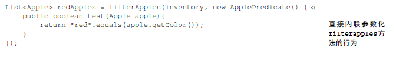

> 在软件工程中，一个众所周知的问题就是，不管你做什么，用户的需求肯定会变
行为参数化就是可以帮助你处理频繁变更需求的一种软件开发模式。

它意味着拿出一个代码块，把它准备好却不执行它，这个代码块以后可以被你的程序其他部分调用

我们看一个例子，我们通过不断改进这个例子，展示行为参数化

# 版本1.1 筛选绿苹果

如果要筛选红苹果怎么办呢?

<!--more-->

# 版本1.2 把颜色作为参数

如果要筛选重量大于150克的苹果怎么办？
你可能会有下面的代码：

这有点令人失望，这打破了DRY(don't repeat yourself 不要重复自己)的软件工程原则

# 版本1.3 对你能想到的每个属性做筛选

这样糟透了，代码可读性降低，而且如果要同时筛选多个属性怎么办？


让我们后退一步来看看更高层次的抽象，一种可能的解决方案是对你的选择标准建模：
需要根据apple的某个属性来返回一个boolean，我们把它称为**谓词**

让我们来定义一个接口来对选择标准建模

```java
public interface ApplePredicate{
    boolean test(Apple apple);
}
```

现在你可以用ApplePredicate的多个实现代表不同的选择标准了


这里使用到了**策略模式**

接下来，你需要filterApple方法接受ApplePredicate对象，对Apple做条件测试，这就是**行为参数化，让方法接受多种行为作为参数，并在内部使用，来完成不同的行为**

# 版本1.4 根据抽象条件筛选


filterAppkes方法的行为取决于你通过ApplePredicate对象传递的代码


目前为止，当要把新的行为传递给filterApples方法的时候，你不得不声明好几个实现ApplePredicate接口的类，然后实例化好几个只会提到一次的ApplePredicate对象，下面是的程序总结了目前看到的一切


很啰嗦，浪费时间！

java有一个机制称为**匿名类**，可以让你同时声明和实例化一个类，换句话说就是随用随建，它可以帮助你改进代码

# 版本1.5 使用匿名类


匿名类也有缺点，往往很笨重，占用很多空间，用起来让人费解，还是不能令人满意。

# 版本1.6 使用lambda表达式

看起来干净很多！

**小结一下：**


# 版本1.7 将list抽奖化
让逻辑不仅适用于apple


# 再举几个真实的例子
## 用comprator来排序
对苹果的按照重量排序
```java
inventory.sort(Apple a1,Apple a2)-> a1.getWeight().compareTo(a2.getWeight());
```
## 用Runable执行代码块
```java
Thread t = new Thread(()->System.out.println("Hello world"));
```

## GUI事件处理
鼠标点击发送后显示一个窗口
```java
button.setAction((ActionEvent event)->label.setText("sent!"));
```
# 小结
- 行为参数化，就是一个方法接受多个不同的行为作为参数，并在内部使用它们，完成不同行为的能力
- 行为参数化可以让代码更好的适应不断变化的要求，减轻未来工作量

（注：内容整理自《Java8实战》）


