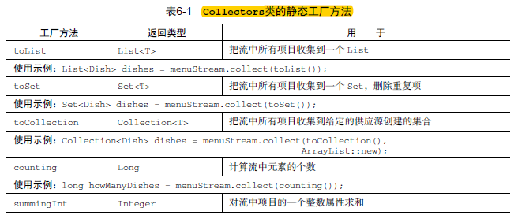
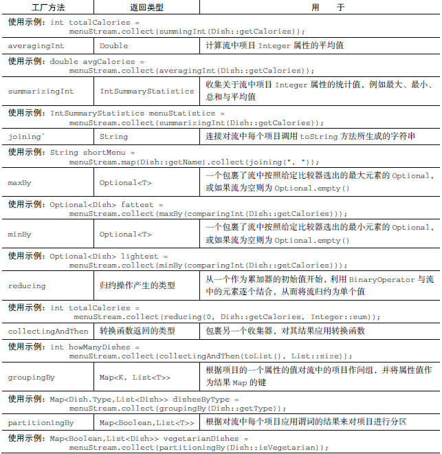

<!-- toc -->
<!-- more -->

# 收集器简介
对流调用collect方法将对流中的元素触发一个规约操作

Collectors实用类提供了很多静态工程方法，可以方便地创建常用收集器的实例，只要拿来用就可以了

最常用的是toList方法，它会把流收集到一个List中：
```java
List<Transcation> transactions = transcationStream.collect(Collectors.toList());
```


## 预定义收集器
Collectors类提供的工厂方法（例如groupingBy）创建的收集器，他们主要提供了三大功能：
- 将流元素规约和汇总为一个值
- 元素分组
- 元素分区

### 规约和汇总
counting方法计算菜单里有多少种菜
```java
long howManyDishes = menu.stream().collect(Collectors.counting());
```
这还可写的更为直接：
```java
long howMangDishes = menu.stream().count()
```
假如你已经导入了Collectors类的所有静态工厂方法，你就可以写counting()而不是Collectors.counting()

假如你想要找到菜单中的热量最高的菜，你可以使用两个收集器，Collectors.maxBy和Collextors.minBy，来计算流中的最大和最小值。

```java
comparator<Dish> disCaloriesComparator = Comparator.comparing(Dish::getCalories);

Optional<Dish> mostCalorieDish = menu.stream().collect(maxby(dishCaloriesComparator));
```

# 汇总
有时候我们想一次操作就获得，最大值最小值总和与平均值，通过summarizing操作你就可以数出菜单中的元素个数，总和，平均值、最大值和最小值
```
IntSummaryStatistics menuStatistics = menu.stream().collect(summarizingInt(Dish::getCalories));
```
IntSummaryStatistics类提供了getter方法来访问每个结果

## 连接字符串
joining工厂方法返回的收集器会把对流中每个对象应用toString方法得到的所有字符串连接成一个字符串
```
String shortMenu = menu.stream().map(Dish::getName).collect(joining());
```
如果Dish类有一个toString方法来返回菜肴的名称，那你无需用提取每一道菜的名称的函数可以得到相同结果：
```java
String shortMenu = menu.stream().collect(joining());
```
字符串可读性不是很好，幸好，joining工厂有一个重载版本可以接受元素之间的分界符，这样就可以得到一个逗号分隔的菜肴名称列表
```java
String shortMenu = menu.stream().collect(joining(", "));
```
## 广义的规约汇总
前面我们说的所有规约过程，其实都是Collects.reducing工厂方法提供的更广义规约收集器的特殊情况

Collects.reducing工厂方法是所有这些特殊情况的一般化，可以说先去的案例仅仅是为了方便程序员而已，例如，reduceing方法创建的收集器来计算你菜单的总热量，如下
```java
int totalCalories = menu.stream().collect(reducing()0,Dish::getCalories,(i,j)->i+j);
```
它需要三个参数：
- 第一个参数是规约的起始值
- 第二个参数就是使用的函数
- 但三个参数是一个BinaryOperator,将两个项目积累成同一类型的值

## 分组
Collectors.groupingBy工厂方法返回的收集器可以完成这项任务
```java
Map<Dish.Type,List<Dish> dishesByType = menu.stream().collect(groupingBy(Dish:getType))
```
如果要按照这两个标准分类怎么办呢？
可以把一个内层groupingBy传递给外层groupingBy
例如：
groupingBy(a,b) a是第一级的条件，b是一个groupingBy

当然第二个参数也可以是一个条件，比如要数一数菜单中每类菜有多少个，可以传递counting收集器作为groupingBy收集器的第二个参数
```java
Map<Dish.Type,Long> typesCount = menu.stream().collect(
                                groupingBy(Dish::getType,counting())
);
```

## 分区
分区是分组的特殊情况，由一个谓词作为分类函数，Map的键类型时boolean，一共两组，ture和false
例如：
```java
Map<Boolean,List<Dish>> partitionedMenu = menu.stream().collect(partitionBy(Dish::isVegrtarian))
```

# 总结下Collectors类的静态方法



# 并行流
## 将顺序流转换为并行流
只需要调用parallel()

另外，你只需要对并行流调用sequential方法就可以把它变成顺序流

## 配置并行流线程池
并行流的线程从那里来？有多少个？怎么定义的？
回答：并行流内部使用了默认的ForkJoinPool，它默认的线程数量就是你的处理器数量，这个值是由Runtime.getRuntime().avaliableProcessors()得到的

改变线程池大小：
```java
System.setProperty("java.util.concurrent.ForkJoinPool.common.parallelism","12")
```
不建议修改

并行化并不是没有代价，并行化过程本身需要对流做递归划分，把每个子流的归纳分配到不同的线程，然后把这些操作的结果合并成一个值，但在多个内核之间移动数据的代价可可能比你想象的大，所以很重要的一点是要保证在内核中并行执行工作的时间比在内核之间传递数据的时间长

总而言之，很多情况下不可能或不方便并行化，然而，在使用stream之前，你必须确保用的对。

还有一些进阶内容 如分支/合并框架、工作窃取，Spliterator,本文不作介绍

# 总结
- collect是一个终端操作，他接受的参数是将流中的元素积累到汇总的各种方式
- 预定义收集器包括将流元素规约和汇总到一个值，例如计算最小值，最大值或平均值
- 预定义收集器可以用groupingBy对流中元素进行分组，或用partitoningBy进行分区
- 收集器可以高效的复合起来，进行多级分组，分区和规约
- 你可以实现Collector接口中定义的方法来开发你自己的收集器
- 内部迭代让你可以并行处理一个流，而无需再代码中显式使用和协调不同的线程
- 虽然并行处理一个流很容易，却不能保证程序在所有情况下都运行的更快
- 从性能角度来说，使用正确的数据结构，如尽可能利用原始流而不是一般化的流

（注：内容整理自《Java8实战》）