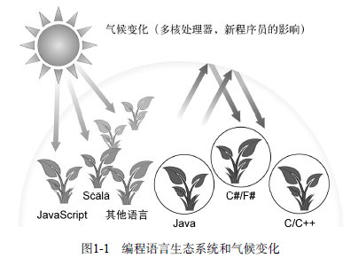
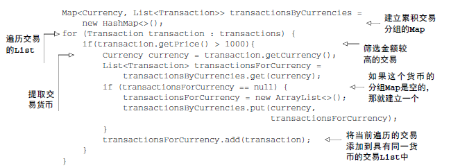
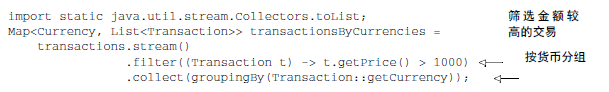

# 1.概述
**为什么你应该关系java8？**
- 因为java8所做的改变，在许多方面比java历史上任何一次改变都深远

再也不哟写下面这种啰嗦的程序了(按苹果重量排序)
```
Collections.sort(inventory,new Comparator<Apple>)(){
   public int compare(Apple a1,Apple a2){
       return a1.getWeight().compareTo(a2.getWeight())
   } 
}};
```
java8中：
```
inventory.sort(Comparing(Apple::getWeight()))
```
java8对cpu核的利用率提高.
- StreamAPI
支持许多处理数据的并行操作，避免用synchronized编写代码

- 把代码传递给方法的简洁方式(方法引用，Lambda)，行为参数化
- 接口中的默认方法

<!--more-->

# 2.java怎么还在变
## java在编程语言生态生态系统中的位置
编程语言生态系统的气候正在变化，程序员越来越多的要处理所谓的**大数据**，并希望利用多核计算机或计算机集群有效的处理，这意味着需要使用**并行处理**

新的语言不断出现，并因为迅速适应了气候变化，越来越受欢迎，也促使java中开发出并行和编写更简洁通用代码的功能



## 流处理
流处理，流是一系列数据项，一次只生成一项，程序可以从输入流中一个一个读取数据项，然后以同样的方式将数据项写入输出流，一个程序的输出流很可能是另一个程序的输入流

基于这一思想，java8在java.util.stream中添加了Stream API,Stream<T>就是一系列T类型的项目，你现在可以把它看成一种比较花哨的迭代器，Stream API的很多方法可以链接起来形成一个复杂的流水线

Java8可以透明地把输入的不相关的部分拿到几个cpu内核上去分别执行你的stream操作流水线--这是**几乎免费**的并行，不用去费劲的搞Thread了

## 用行为参数化把代码传递给方法
java8增加了把方法作为参数传递给另一个方法的能力，我们把这一概念称为为**行为参数化**

## 并行和共享的可变数据
使用流处理，你需要放弃什么，你的行为必须能够同时对不同的输入**安全地执行**，一般情况下这就意味着，你写代码时不能访问共享的可变数据，这些函数有时被称为“纯函数”或“无副作用函数”或“无状态函数”

## java需要演变
语言需要不断改进以跟进硬件的更新或满足程序员的期待

# 3.java中的函数
编程语言中的**函数**一词通常指**方法**，尤其是静态方法，这是在数学函数，也就是没有副作用的函数之外的新含义，幸运的是，你将会看到，在java8谈到函数时，这两种用法几乎是一致的

java8中新增了函数--值的一种新形式

编程语言的整个目的就在于操作值，要是按照历史上编程语言的传统，这些值因此被称为一等值，编程语言中的其他结构比如方法等，在程序执行期间不能传递，而是二等公民，人名发现在运行时传递方法能将方法变成一等公民，这在编程中非常有用，因此java8设计者把这个功能加入到java中

方法不再是二等值了，与用对象引用传递对象类似，在java8里写在诸如
```
File::isHidden
```
的时候，就创建了一个方法引用，你同样可以传递它

**lambda--匿名函数**
你可以写 (int x)->x+1表示，调用是给定参数x。就返回x+1值的函数

我们说使用这些概念的程序为函数式编程风格，这句话的意思是“编写把函数作为一等值来传递的程序”

# 4.流
几乎每个java应用都会制造和处理集合，但集合用起来并不总是这么理想，比如你㤇从一个列表中筛选金额较高的交易，然后按照货币分组，你需要写一大堆套路化的代码来实现这个数据处理命令，如下


一眼很难看出来代码时做什么的，然后使用stream API 你现在可以这样解决这个问题


看上去有点神奇，和Collection API相比 Stream API处理数据的方式很不同 ，用集合的话，你到自己去做迭代的过程，你得用for-each循环去一个个的去迭代元素，然后处理元素，我们把这种数据迭代方法称为**外部迭代**，有了Stream API ，你根本不用操心循环的事情，数据处理完全是在库内部进行的，我们把这种思想叫做**内部迭代**

使用集合另一个头疼的地方是，数据量特别大，要怎么处理这个巨大的列表呢，理想情况下，你可能想让多核cpu共同分担处理工作，以缩短处理时间，理论上来说，钥匙你有8个核，那并行起来，处理数据的速度应该是单核的八倍

# 5.默认方法
接口如今可以包含实现类没有提供实现的方法签名了

使用新的关键字default来表示这一点

一个类可以实现多个接口，如果好几个接口里都有多个默认实现，是否意味着java中有了某种形式**的多重继承**？ 是的，在某种程度上是这样的

# 6.来自函数式编程的其他好思想
java从函数式编程中引入了两个核心思想：将方法和lambda作为一等值和在没有可变共享状态时，函数或方法可以有效、安全地并行执行

常用的函数式语言，如SML、OCaml、Haskell,还提供了进一步的结构来帮助程序员，其中之一就是通过更多的描述性数据类型来**避免null**

在java8里面有一个Optional<T>类，如果你能一致地使用它的话，就可以帮助你避免出现NullPointer异常

第二个想法是模式匹配，你可以把模式匹配看做switch的扩展，可以同时将一个数据类型分解成元素

# 7.小结
- 语言面临“要么改变，要么衰亡”的压力。
- java8新增了令人激动的新概念和功能，方便我们编写有效又简介的程序
- 函数式一等值
- stream改变使得collection的许多方面得以推广，代码更易读，并允许并行流处理
- 你可以在接口中使用默认方法
- 其他来自函数式编程的有趣思想，包括处理null和使用模式匹配

（注：内容整理自《Java8实战》）