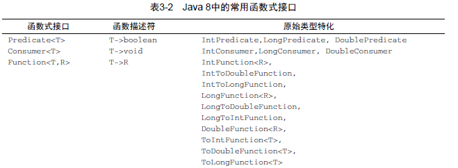

> Lambda表达式，它可以很简洁地表示一个行为或传递代码，现在你可以把Lambda表达式看作匿名功能，它基本上就是没有声明名称的方法，但和匿名类一样，它也可以作为参数传递给一个方法

# Lambda管中窥豹
可以把lambda表达式理解为简洁地表示可传递的匿名函数的一种方式：它没有名称，但它有参数列表，函数主体，返回类型，可能还有一个可以抛出的异常列表

lambda表达式有三部分：
- 参数列表
- 箭头
- lambda主体

<!--more-->


有效的lambda表达式举例：
```java
(String s)->s.length()
```
这个lambda表达式具有一个string类型的参数，返回一个int，lambda没有return语句，因为已经隐含了return

```java
(Apple a)->a.getWeigh()>150
```
这个lambda表达式有一个Apple类型的参数并返回一个boolean

```java
(int x,int y)->{
    System.out.println("Result:");
    System.out.println(x+y);   
}
```
这个lambda表达式具有两个int类型的参数，没有返回值，注意lambda表达式可以包含多行语句

```java
()->42
```
这个lambda表达式没有参数，返回一个int

lambda表达式的基本语法是：
**(parameters)-> expression**
或：
**(parameters)-> {expression}**

下面哪个不是有效的lambda表达式？
```java
()->{}
```
有效，lambda没有参数，返回void

```java
()->"Raoul"
```
有效，lambda没有参数，返回string

```java
()->{return "Mario";}
```
有效，lambda没有参数，返回string，可以显示的写返回语句

```java
(Integer i)->return "Alan"+i;
```
无效，需要使用花括号，如下：(Integer i)->{return "Alan"+i;}

```java
(String s)->("IronMan";)
```
"IronMan"是一个表达式，不是一个语句，要使用此lambda有效，你可以去除花括号
或者，可以显示的返回如下：(String s)->{return "IronMan"}

# 在哪里以及如何使用Lamdda
可以在函数式接口上使用lambda
## 函数式接口
函数式接口就是指定义一个抽象方法的接口
比如：
```java
public interface Predicate<T>{
    boolean test (T t)
}
```
```java
public interface Compartor<T>{
    int  compare(T o1,T o2);
}
```
```java
public interface Runnable{
    void run();
}
```
我们还知道，接口现在还可以拥有默认方法，哪怕有很多默认方法，只要接口只定义一个抽象方法，它就仍然是一个函数式接口

## @FunctionalInterface
这个标注用于表示该接口会设计成一个函数式接口，如果你用了这个注解，而它却不是一个函数式接口的话，编译器将返回一个提示原因的错误

# 使用函数式接口
为了应用不同的lambda表达式，你需要一套能够描述常见函数描述符的函数式接口
比如之间我们见过的Comparable Runnable Callable

## Predicate
java.util.function.Predicate<T> 接口定义了一个名叫test的抽象方法，它接受泛型T对象，并返回一个boolean,在你需要一个涉及类型T的布尔表达式时，就可以使用这个接口

## consumer
java.util.funtion.Consumer<T> 定义了一个名叫accept的抽象方法，它接受泛型T的对象，没有返回，你如果需要访问类型T对象，并对其进行某些操作，可以使用这个接口

## Function
java.util.funtion.Funtion<T,R>接口定义了一个叫作apply的方法，它接受一个泛型T的对象，并返回一个泛型R的对象，如果你需要定义一个lambda，将输入对象的信息映射到输出，就可以使用这个接口

java8中常用的函数式接口



lambda及函数式接口的例子


# 类型检查，类型推断以及限制
## 类型检查
lambda的类型时从使用拉门等到的上下文推断出来的，比如，接受它传递的方法的参数，或接受它的值的局部变量

lambda表达式类型检查过程


# 使用局部变量
lambda表达式允许使用自由变量（不是参数，而是在外层作用域中定义的变量）
例如：
```java
int portNumber = 1337;
Runnable r = {}->System.out.println(portNumber)
```
尽管如此，有一些限制，lambda可以没有限制地捕获实例变量和静态变量，但是局部变量必须显示声明为final或事实上是final。换句话说，lambda表达式只能捕获指派给他们的局部变量一次

为什么？
1. 实例变量和局部变量背后的实现有一个关键不同，实例变量储存在堆中，而局部变量保证在栈上，如果lambda可以访问局部变量，而且lambda是在一个线程中使用的，则是哟lambda线程可能会分配该变量的线程将这个变量回收之后，去访问该变量。因此，java在访问自由局部变量时，实际上在是在访问它的副本，而不是访问原始变量，
2. 这一限制不鼓励你使用改变局部变量的典型命令式编程模式，这种模式会阻碍并行处理


# 方法引用
方法引用让你可以重复使用现有的方法定义，并像Lambda一样传递他们，他们似乎更易读，感觉也更自然
例如
先前:
```
inventory.sort((Apple a1,Apple a2)
                ->a1.getWeigh().compareTo(a2.getWeight()));
```
之后(使用方法引用和java.util.Comparator.comparing)
```java
iventory.sort(comparting(Apple::getWeight));
```
方法应用可以被看作仅仅调用特定方法的lambda的一种快捷写法，当你需要使用方法引用时，目标引用放在分隔符::前。方法的名称放在后面，不需要括号，因为没有实际调用这个方法

# 复合lambda表达式
你可以把多个简单的lambda复合成复杂的表达式，比如两个谓词进行一个or操作，还可以让一个函数的结果成为另一个函数的输入

比如
## 逆序
```java
inventory.sort(comparing(Apple::getWeight).reversed())
```
## 比较器链
```java
inventory.sort(comparing(Apple::getWeight)
            .reversed()
            .thenComparing(Apple:getCountry()));
```
# 谓词复合
三个方法：negate() and() or()

# 函数复合
andThen() 意味着g(f(x))
compose() 意味着f(g(x))

# 小结
- lambda表达式可以理解为一种匿名函数
- 函数式接口就是仅仅声明了一个抽象方法的接口
- 只有在接受函数式接口的地方才可以使用Lambda表达式
- java8自带了一些常用的函数式接口，放在java.util.function包里
- 方法引用让你重复使用现有的方法并直接传递他们

（注：内容整理自《Java8实战》）