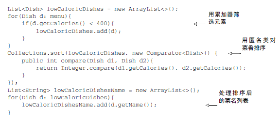
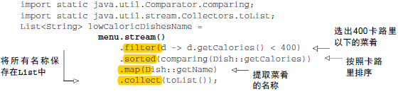
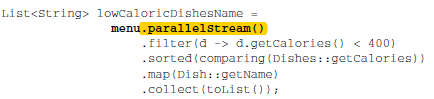
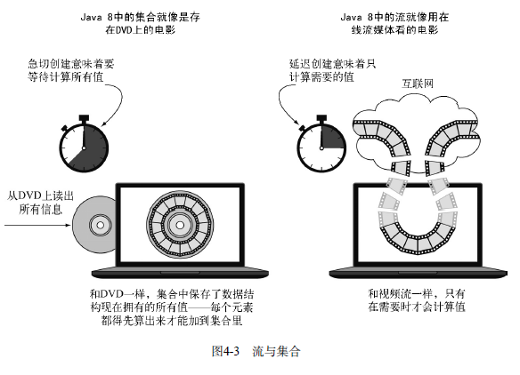
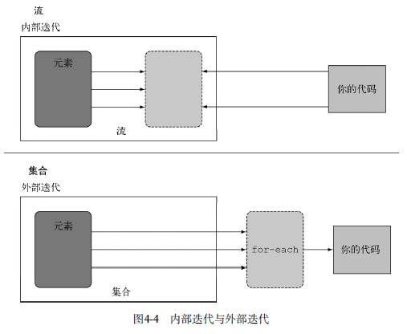
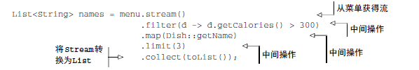
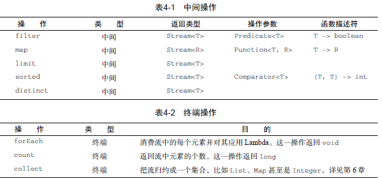

> 几乎每个java应用程序都会制造和处理集合，要是没有集合，还能做什么呢？尽管集合对于几乎任何一个java应用都是不可或缺的，但是集合操作却远远算不上完美

<!--more-->

- 很多业务逻辑都涉及类似于数据库的操作，比如对几道菜按照类别进行分组，查找出最贵的菜，大部分数据库都允许你声明式地指定这些操作，你不需要实现如何筛选，你只需要表达你想要的，都替你办好了，**怎么到了集合就不能这样了呢？**
- **如果要处理大量元素该怎么办？为了提高性能，你需要并行处理** ，并利用多核架构，但是写并行代码比迭代器还复制，调试困难

为了解决这些问题，java语言的设计者做做些什么.你可能已经猜到了，答案就是**流**

# 流是什么
流是Java API的新成员，它允许你以声明性的方式处理数据集合（通过查询语句来表达，而不是临时写一个实现），你可以把他们看成遍历数据集的高级迭代器，此外，流还可以透明的并行处理，你无需写任何多线程的代码了

## 比较java7与java8
写一段返回低热量菜肴名称，并按照卡路里排序的代码

java7：

java8:

为了利用多核架构并行执行这段代码，你只需要把stream()缓存parallelStream()

## java8优势
- 代码时声明式的，说明你想要完成什么，而不是说明如何实现
- 你可以把几个基础操作连接起来，来表达复杂的数据操作流水线
- 用不着为了任务并行而去操心线程和锁了，streamAPI都帮你做好了

简而言之，java8 Stream
- 声明性--更简洁，更易读
- 可复用--更灵活
- 可并行--性能更好

## 流简介
要讨论流我们先来谈谈集合，这是最容易上手的方式了，java8中的集合支持一歌新的stream方法，会返回一个流，**当然还有很多其他的方法可以得到流，比如利用数据范围或从I/O资源生成流元素**

## 流定义
简单的定义就是，从支持数据处理操作的源生成的元素序列

- 元素序列--集合讲的是数据，流讲的是计算
- 源--流会使用一个提供数据的源，有序集合和列表生成的流，元素顺序会被执
- 流水线 很多流操作本身返回一个流，这样多个操作就可以链接起来，形成一个大的流水线
- 内部迭代--流的迭代操作是在背后进行的

# 流与集合对比
粗略的说，集合与流之间的差异在于什么时候进行计算

集合是一个内存中的数据结构，它包含数据解雇中目前所有的值

流则是在概念上固定的数据结构，元素是按需计算的，那些值，在看不见的地方，只会按需生成，这是一种生产者-消费者关系，从另一个角度来说，流就是像一个延迟创建的集合，只有在消费者要求的时候才会计算值

用DVD对比在线流媒体的例子展示流与集合之间的差异

## 只能遍历一次
**流只能遍历一次，遍历完了之后，我们说这个流已经被消费掉了**
你可以从原始数据哪里再获得一个新的流来重新遍历一遍，就想迭代器一样

## 外部迭代与内部迭代

# 流操作
流操作可以分为两大类，我们看下前面的例子：

- filter、map、limit可以连成一条流水线
- collect触发流水线执行并关闭它

可以连接起来的流操作称为**中间操作**，关闭流的操作称为**终端操作**

## 中间操作
触发流水线上触发一个终端操作，否则中间操作不会执行任何处理，**他们很懒，这是因为中间操作一般都可以合并起来，在终端操作时一次性全部处理，只使用一次遍历**

## 终端操作
终端操作会从流的流水线生成结果，其结果是任何不是流的值，比如List，Integer,甚至是void

## 使用流
流的使用一般包括三件事：
- 一个数据源来执行一个查询
- 一个中间操作链，形成一条流的流水线
- 一个终端操作，执行流水线，并生成结果

操作列表(不完全，以后还会介绍更多)：

# 小结
- 流是“从支持数据处理操作的源生成的一系列元素”
- 流利用内部迭代
- 流操作有两类：中间操作和终端操作
- 中间操作返回一个流，并可以链接在一起，可以用他们来设置一条流水线，但并不会生成任何结果
- 终端操作会返回一个非流的值，并处理流水线的返回结构
- 流中的元素是按需计算的

（注：内容整理自《Java8实战》）