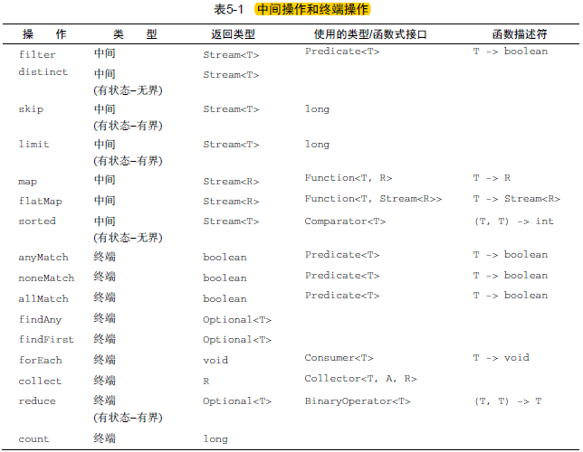
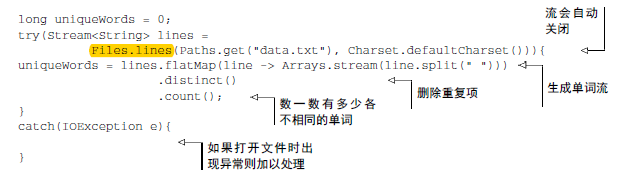

# 筛选和切片
## 用谓词筛选
**filter方法**
会接收一个谓词（一个返回Boolean）作为参数，并返回一个包括所有符号谓词的元素的流

<!--more-->

例子:筛选所有的素菜
```java
List<Dish> vegetarianMenu = menu.stream().filter(Dish::isVegetarian).collect(toList());
```


## 筛选各异的元素
**distinct方法**
他会返回一个元素各异的流，实现原理是根据元素的hashCode和equals方法

例子：筛选偶数，且不重复
```java
List<Integer> numbers = Arrays.asList(1,2,1,3,3,2,4);
number.stream().filter(i->1%2==0)
               .distinct()
               .forEach(System.out.println);
```

## 截断流
**limit(n)方法**
该方法会返回一个不超过给定长度的流，如果流是有序的，则最多会返回前n个元素

例子：选出热量超过300卡路里的头三道菜
```java
List<Dish> dishes = menu.stream()
                        .filter(d-d.getCalories()>300)
                        .limit(3)
                        .collect(toList());
```

## 跳过元素
**skip(n)方法**，返回一个扔掉前n个元素的流，如果流中元素不足n个，则返回一个空流，请注意limit(n)和skip(n)是互补的

# 映射
一个常见的数据处理套路就是从某些对象中选择信息，比如在sql里面，可以从表中选择一列

## 对流中每个元素应用函数
**map方法**
它会接收一个函数作为参数，这个函数会被应用到每个元素上，并将其映射成一个新的元素（注意是创建一个新的版本，而不是去修改）

例子：提取菜肴的名称
```java
List<String> dishNames = menu.stream().map(Dish::getName).collect(toList());
```

## 流的扁平化
例子：对应一张单词表，如果返回一个列表，列出里面各不相同的字符
比如单词列表["Hello","Woeld"]你想要返回的列表["H","e","l","o","W","r","d"]

你可能会觉得很容易，调用distinct方法就可以了
```java
words.stream()
    .map(word->word.split(""))
    .distinct()
    .collect(toList());
```
这个方法的问题在于，传递给map方法的lambda为每个单词返回了一个String[],因此map返回的流实际上是Stream<String[]>类型，我们真正想要的是Stream<String>

幸好有**flatMap**来解决这个问题

尝试1：使用map和Arrays.stream()
首先，你需要一个字符流，而不是数组流，有一个Arrays.stream()的方法，可以接受一个数组并产生一个流
```java
words.stream()
    .map(word->word.split(""))
    .map(Arrays::stream)
    .distinct()
    .collect(toList());
```
这个方案仍然搞不定！因为现在得到的是一个流的列表,你先是把每个单词转换成一个字母数组，然后把每个数组变成一个独立的流。

尝试2：使用flatMap
```java
words.stream()
    .map(word->word.split(""))
    .flatMap(Arrays::stream)
    .distinct()
    .collect(toList());
```
flatMap方法的效果是，各个数组并不是分别映射成一个流，而是映射成流的内容，所有使用map(Arrays::stream)时生成的单个流都被合并起来，即扁平化为一个流，

一言以蔽之，flatMap方法让你把一个流中的每个值都换成另一个流，然后把所有的流连接起来成为一个流

# 查找和匹配
## 检查谓词是否至少匹配一个元素
**anyMatch方法**
可以回答“流中是否有一个元素能匹配给定的谓词”
例子：菜单里面是否有素食可选择
```java
if(menu.stream().anyMatch(Dish::isVegetarian)){
    ...
}
```
## 检查谓词是否匹配所有元素
allMatch()用法同上
与allMatch()相对的是noneMatch()

anyMatch allMatch noneMatch 三个操作都用到了我们所谓的短路，就是大家熟悉的java中的&&和||运算符短路在流中的版本

## 查找元素
**findAny方法**
将返回当前流中的任意元素

**findFirst**
找到第一个元素

# 规约
reduce操作表达更复杂的查询，比如"计算菜单中的总卡路里"或“菜单中卡路里最高的菜是哪一个” 这需要将流中的元素反复结合起来，得到一个值，比如Integer,这样的查询被归类为规约操作，用函数式编程术语来说，这称为折叠(fold)

## 求和
```java
int producr = numbers.stream().reduce(1,(a,b)->a*b);
```

reduce操作是如何作用于一个流的：
lambda反复结合每个元素，知道流被规约为一个值

可以使用最更简洁的代码：
```
int producr = numbers.stream().reduce(0,Integer::sum);
```
reduce还有一个重载的变体，它不接受初始值，返回一个Optional对象：
Optional<Integer> sum = numbers.stream().reduce((a,b)->(a+b));

## 最大值和最小值
```java
Optional<Integer> max = numbers.stream().reduce(Integer::max)

Optional<Integer> min = numbers.stream().reduce(Integer::min)
```

# 总结下目前说到的操作


# 数值流
之前我们看到了可以使用reduce方法计算流中元素的总和，例如：
```java
int calories = menu.stream()
                    .map(Dish::getCalories)
                    .reduce(0,Integer::sum);
```
这段代码的问题是，它有一个暗含的装箱成本，每个Integer都必须拆箱成一个原始类型，再进行求和，要是可以直接像下面这样调用sum方法，岂不是更好
```java
int calories = menu.stream()
                    .map(Dish::getCalories)
                    .sum();
```
这是不可能的，问题在于map方法会生成一个Straem<T>，虽然流中的元素是Integer类型，但Streams接口没有定义sum方法，不要担心，Stream API还提供了原始类型流特化

## 原始类型流特化
Java9引入了三个原始类型特化接口来解决这个问题：IntStream，DoubleStream和LongStream，分别将流中的元素特化为int，long，double,从而避免了暗含的装箱成本，每个接口都带了进行常用数值规约的新方法，比如对数值流求和的sum，找到最大元素的max，此外有必要时再把他们转换回对象流的方法

1.映射到数值流
例子：
```java
int calories = menu.stream()
                    .mapToInt(Dish::getCalories)
                    .sum();
```

2.转换回对象流
把原始流转换成一般流，可以使用boxed方法
```java
IntStream intStream = menu.stream().mapToInt(Dish::getCalories);
Stream<Integer> stream = intStream.boxed();
```
3.默认值optionalInt
求和有默认值0，但是如果计算intStream中最大的元素，就得换个法子了，因为0是错误的结果，我们知道Optional类，这是一个可以表示值存在或不存在的容器，Optional可以用Integer、String等参考类型来参数化，对于三种原始流特化，也分别有一个optional原始类的特化版本：OptionalInt,OptionalDouble,OptionalLong
例如：
```java
OptionalInt maxCalories = menu.stream().mapToInt(Dish::getCalories).max();
```
## 数值范围
java8引入了两个可以用于IntStream和LongStream的静态方法，帮助生成这种范围：range和rangeClosed。第一个参数接受起始值，第二个参数接受结束值。
例子：
```java
InStream evenNumbers = IntStream.rangClosed(1,100).filter(n->n%2==0)
```

# 构建流
本节介绍如何从值序、数组、文件来创建流，甚至由生成函数来创建无限流

## 由值创建流
可以使用静态方法Stream.of，它可以接受任意数量的参数
例如：以下代码创建一个字符串流，然后你可以将字符串转换为大写，再一个个打印出来
```java
Stream<String> stream = Stream.of("Java 8","Lambda","In","Action");
stream.map(String::toUpperCase).forEach(System.out::println);
```
## 由数组创建流
可以使用静态方法Arrays.stream从数组创建一个流，例子：
```java
int[] numbers = {2,3,5,7,11,13};
int sum = Arrays.stream(number).sum();
```
## 由文件生成流
Files.lines方法，它会返回一个由指定文件中的各行构成的字符串流


## 创建无限流
Stream API提供两个静态方法来从函数生成流：Stream.iterate和Stream.generate
这两个操作可以创建所谓的无限流：他们产生的流会用给定的函数按需创建值，因此可以无穷无尽地计算下去，一般来说，应该来说应该使用limit(n)来对这种流加以限制，以避免打印无穷多个值

例子
```java
Stream.iterate(0,n->n+2)
      .limit(10)
      .forEach(System.out.println)
```

generate不是依次对每个生成的值应用函数的，它接受一个Supplier<T>类型的lambda提供新的值

例子
```java
Stream.generate(Math::random)
      .limit(5)
      .forEach(System.out::println)
```

# 小结
- 流可以简洁地表达复杂的数据处理查询，流可以透明的并行化
- 你可以使用filter、distinct、skip和limit对流做筛选和切片
- 你可以使用map和flatMap提取或装换流中的元素
- 你可以使用findFirst和findAny方法查找流中的元素，你可以使用allMatch、noneMatch和anyMatch方法让流匹配给定的谓词
- 这些方法都利用了短路：找到结果就立即停止计算，没有必要处理整个流
- 你可以利用reduce方法将流中的所有元素迭代合并成一个结果，例如求和或查找最大元素
- filter和map等操作是无状态的，他们并不储存任何状态，reduce等操作要储存状态才能计算出一个值，sorted和distinct等操作也要储存状态，因为他们需要把流中的所有元素缓存起来才能返回一个新的流，这种操作称为有状态操作
- 流不仅可以从集合创建，也可以从、数组、文件以及iterate与generate等特定方法创建
- 无限流是没有固定大小的流

（注：内容整理自《Java8实战》）