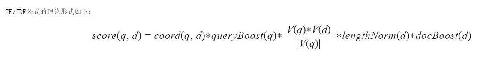
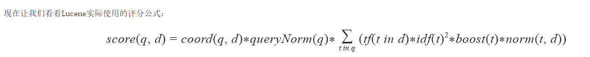

> elasticsearch使用了lucene的评分功能,lucene默认评分机制：TF/IDF(词频/逆文档频率)算法

<!-- more -->

# lucene默认评分机制：TF/IDF(词频/逆文档频率)算法默认评分公式解释

## 何时文档被匹配上
当一个文档经过lucene返回，则意味着该文档与用户提交的查询时匹配的，在这种情况下，每个返回的文档都会有一个得分，得分越高，文档相关度更高，但是，**同一个文档针对不同查询的得分是不同的，比较某个文档在不同查询中的分数是没有意义的**，这是因为文档得分依赖多个因子，除了权重和查询本身的结构，还包括匹配的词项的数目，词项所在字段，以及用于查询规范化的匹配类型等。

### 计算文档得分需要考虑以下因子

- 文档权重（document boost）：**索引期**赋予某个文档的权重值

- 字段权重（field boost）:**查询期**赋予某个字段的权重值

- 协调因子（coord）：基于文档中词项命中个数的协调因子，**一个文档中命中了查询中的词项越多，得分越高**
  (*比如：查询关键词被分词为A和B,如果文档1命中了A和B,文档2命中了A,那么在这个项目上，文档1的分数更高*)

- 逆文档频率(inverse document frequency):一个基于词项的因子,用来告诉评分公式该词项有多么**罕见**，逆文档频率越低，词项越罕见，评分公式利用该因子为包含罕见词项的文档加权
  (*比如：查询关键词是A和B,如果文档1命中了A,文档2命中了B,但是在整个文档范围内，A出现的次数比B少，那么在这个项目中，文档1分数更高*)

- 长度范数(length norm):每个字段的基于词项个数的归一化因子，一个字段包含的词项越多，改因子的权重越低，**这意味着lucene评分公式更"喜欢"包含更少词项的字段*
  (*比如：查询关键词是A,文档1和2都匹配上了A,但是文档1内容长度比文档1短，那么在这个项目中，文档1分数更高*)

- 词频：一个基于词项的因子，用来表示一个词项在某个文档中出现多少次，**词频越高，文档得分越高**
 (*比如：查询关键词是A，文档1和文档1都匹配上了，但是文档1中出现了2次A,文档2中出现了1次A,那么在这个项目中，文档1分数更高*)

- 查询范数（query norm）：一个基于查询的归一化因子，它等于**查询中词项的权重平方和**，**查询范数使得不同查询的得分能相互比较，尽管这种比较通常是困难且不可行的**

## TF/IDF评分公式
### Lucene理论评分公式
注意，你并不需要深入理解这个公式的来龙去脉，了解它的工作原理非常重要

上面的公式理论形式糅合了布尔检索模型和向量空间检索模型，我们可以不讨论这个理论评分公式，直接跳到lucene实际评分公式
### Lucene实际评分公式
现在让我来看看Lucene实际评分公式：

解释：这是一个关于**查询q**和**文档d**的函数，有两个因子coord和queryNorm并不直接依赖查询词项，而是与查询词项的一个**求和公式**相乘，**求和公式**中的每个加数由以下因子连乘所得：词频 逆文档频率 词项权重 长度范数

由这个公式我们可以导出一些规则：
- 越多罕见的词项被匹配上，文档分数越高
- 文档字段越短，文档分数越高
- 权重越高（无论是索引期还查询期赋予的权重值），文档得分越高

## elasticsearch如何看评分
elasticsearch使用了lucene的评分功能，但是好在**我们可以替换默认的评分算法**，**elasticsearch使用了Lucene的评分功能但是不仅限于lucene的评分功能**，用户可以**使用各种不同的查询类型**以精确控制文档的评分计算，如custom_boost_factor查询、constant_score查询，custom_score查询）还可以通过使用**脚本（scrpting）**来改变文档得分，还可以使用**二次评分**功能，通过在返回文档集合之上执行另外一个查询，重新计算前N个文档得分

（注：内容整理自《深入理解elasticsearch》，斜体为本人添加的理解）

