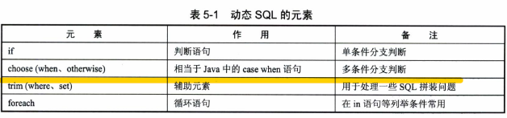
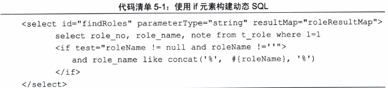
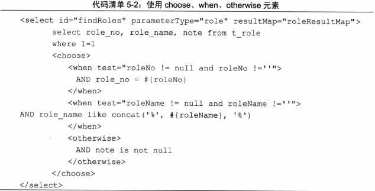
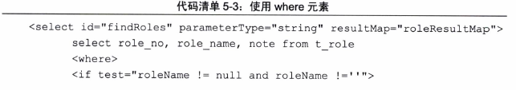
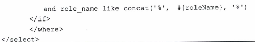
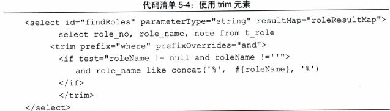
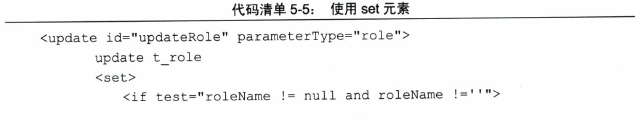
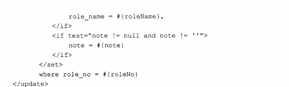
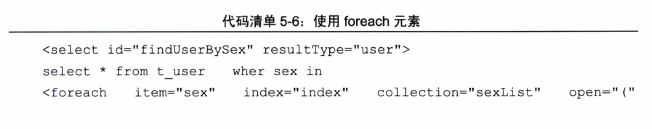
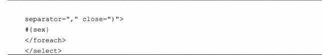

如果使用JDBC或者其他框架，很多时候你得根据需要去拼装SQL,这是一个麻烦的事情，mybatis提供对sql语句动态的组装能力。大部分判断可以在mybatis的映射XML文件里面配置

mybatis也可以在注解中配置SQL，但是由于注解配置功能受限，对于复杂SQL而言可读性差，较少使用

# 概述
动态SQL包括以下几种元素


<!--more-->

# if
if元素是最常用的判断语句，它常常与test属性联合使用

使用场景举例：**不填写的时候不要用它作为查询条件**



# choose when otherwise
类似java中的 switch case default语句

使用场景举例：
- 当角色编号不为空，则只用角色编号作为查询条件
- 当角色编号为空，而角色名称不为空，则用角色名称作为条件进行模糊查询
- 当角色编号和角色名称都为空，则要求角色备注不为空



# trim where set
一般写sql的时候都要加一个条件 1=1 ，如果没有加，sql语句可能会报错

例如：
```
select role_no, role_name, note from t_role where role_name like concat('%',#{roleName}，'%')
```
当然我们也可以去掉1=1，我们可以用where元素




当where元素里面的条件成立的时候，才会加入where这个关键字组装到sql里面

有时候我们需要一些特殊的sql语法，比如常见的and or，使用trim可以达到我们预期的效果



trim元素意味着我们需要去掉一些特殊的字符串，prefix代表是语句的前缀，而prefixOverrides代表的是你需要去掉的那种字符串

我们常常需要更新某一个对象，发送所有字段给持久对象，现实中我们往往需要更新一部分字段，set元素可以完成这个功能




同样我们可以把它转变为trim元素
```
<trim prefix="SET" suffixOverrides=",">...</trim>
```
# foreach
foreach元素是一个循环语句，遍历集合




说明：
- colletion配置的sexList是传递进来的参数名称，它是一个数组或者List，Set等集合
- item配置的是循环中的当前元素
- index配置的是当前元素在集合的位置小标
- open和close配置的是以什么符号将这些元素包装起来
- separator是各个元素的间隔符

# test元素
用于条件判断语句
```
<if test="type='Y'">
where 1=1
</if>
```

（注：内容整理自《深入浅出MyBatis技术原理与实战》）
