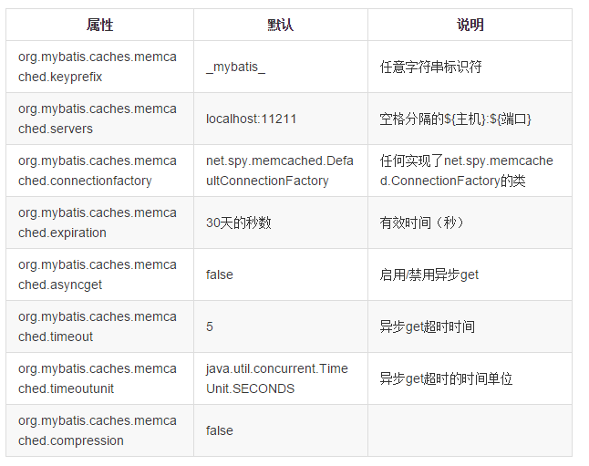

> MyBatis提供一级缓存和二级缓存，其中一级缓存是sqlSession级别的缓存，不同的sqlSession之间的缓存互不影响。二级缓存是Mapper级别的缓存，多个sqlSession操作同一个Mapper，其二级缓存是可以共享的。

<!-- more -->

MyBatis有多种二级缓存方案可供选择。其中对Memcached的支持较为成熟，现以Memcached为例介绍与spring项目的集成。

## 使用配置
### 配置pom.xml，添加依赖。

```xml
<dependencies>
  ...
  <dependency>
   <groupId>org.mybatis.caches</groupId>
   <artifactId>mybatis-memcached</artifactId>
   <version>1.0.0</version>
  </dependency>
  ...
</dependencies>
```

### 全局开关

```xml
<settings>
   <setting name="cacheEnabled" value="true"/>
</settings>
```
### 配置需要缓存的mapper.xml
二级缓存是Mapper级别的，可以针对具体的mapper.xml开启二级缓存。

```xml
<mapper namespace="org.acme.FooMapper">
  <cache type="org.mybatis.caches.memcached.MemcachedCache" />
</mapper>
```
开启后，则mapper中所有的select语句默认都将被缓存，此命名空间下所有insert、update、delete语句将会导致空间下的缓存被清空。

可以针对具体某条语句禁用缓存。

```xml
  <select id="retObj" resultMap="results" useCache="false" >
      select id, name, sex from employee   
  </select>
```
也可针对某条语句触发刷新动作（默认对应所有插入、更新、删除语句）。

```xml
  <select id="retObj" resultMap="results" flushCache="true" >
      select id, name, sex from employee   
  </select>
```

### 配置参数在memcached.properties中设置，如果缺失则使用缺省设置。
以下是配置参数：



### 如果需要记录cache操作日志，可由如下配置实现

```xml
<mapper namespace="org.acme.FooMapper">
  <cache type="org.mybatis.caches.memcached.LoggingMemcachedCache" />
  ...
</mapper>
```

### 注意事项
缓存在Memcached中的类需要实现Serializable接口，否则会报错java.io.NotSerializableException。

## 参考文档
[MyBatis 缓存机制深度解剖 / 自定义二级缓存](http://www.iteye.com/topic/1112327)

[MyBatis的二级缓存的设计原理](http://blog.csdn.net/luanlouis/article/details/41408341)

[Caching over MyBatis : Memcached Performance Tuning Over MyBatis](https://dzone.com/articles/caching-over-mybatis-memcached)