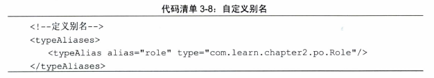

Mybatis配置XML文件的层次结构


这些层次是不能够颠倒顺序的，如果颠倒顺序，mybatis解析xml文件时会出现异常

<!--more-->

# properties元素

properties元素提供三种配置方式
- property子元素
- property配置文件
- 程序参数传递

## property子元素
如图：


这样我们就可以在上下文中使用以及配置好的属性了

如图：
```
<dataSource type="POOLED">
    <property name="driver" value="${dirver}"
    <property name="url" value="${url}"
    <property name="username" value="${username}"
    <property name="password" value="${password}"
</dataSource>
```

## properties
使用配置文件，方便我们在多个配置文件中重复使用它们，也方便日后维护和随时修改

如图：


我们properties文件放在源包下，只要这样引入这个配置文件即可
```
<properties resource="jdbc.properties"/>
```

## 程序参数传递
适用场景举例：生产数据库用户名和密码对于开发者保密，运维人员要求文件中的数据库用户和密码进行加密，需要在代码中进行解码传入配置，这个时候需要通过编码的范式满足我们遇到的场景

如图：
InputStream  cfgStream = null;

decode为解密方法

## 优先级
mybtis支持这三种方式同时出现，可以重复配置同一属性

mybtis按照下面的顺序加载：
1. 在properties元素体内的指定属性首先被读取
2. 根据properties预算内宿的resource属性读取类路径下属性文件，或者根据url属性指定的路径读取属性文件，并覆盖已读取的同名属性
3. 读取作为方法参数传递的属性，并覆盖已读取的同名属性

总结：优先级 代码>配置文件>properties属性

# setting
- setting在mybatis中是最复杂的配置，也是最重要的配置
- 即使不配置setting，mybatis也可以正常工作
- 了解setting配置内容，十分必要

如图：


# typeAliases
- 别名是一个指代的名称，因为类的全名过长，我们希望用简短的方式去指代它
- 这个名称可以在mybatis上下文中使用
- 别名不区分大小写
- 一个别名实例是在解析配置文件时生成的，然后长期保持在configuration对象中，供随时使用

类型：
- 系统定义的别名
- 自定义别名

## 系统定义的别名


注：支持数组类型的只要加“[]”即可，比如Date数组可以用date[]代替

## 自定义别名
方式：
- 配置文件
- 代码

### 配置文件：


这样mybtis的上下文中使用role来替代其全路径

### 注解+自动扫描


使用注解@Alias，Mybatis会自动扫描包，将扫描到的类装载到上下文中以便将来使用

注意：配置了包扫描路径，没有注解的类，mybatis也会装载，只是说它将把别名设置为类名第一个字母小写

# typeHandler
- Mybatis在预处理语句(PrepareStatement)中设置一个参数时，或者从结果集(ResultSet)中取出一个值时，都会用注册了的typeHandler进行处理
- 由于数据库厂商不同，参数不同，typeHandler允许根据项目的需要自定义设置java传递到数据库的参数中，或者从数据库读出的数据，进行特殊处理
- 在使用枚举的时候我们常常使用typeHandler进行转换

类型：
- 系统定义
- 用户自定义

typeHandler常用的配置为java类型（javaType）、JDBC类型（jdbcType）,typeHandler的作用就是将javaType和jdbcType互相转化

由于篇幅考虑，typehandler不详细说明

# ObjectFactory
当mybatis在构建一个结果返回的时候，都会使用ObjectFactory去构建POJP，在mybatis中可以定制自己的ObjectFactory，一般来说我们使用默认的ObjectFactory即可，默认的ObjectFactory是由org.apache.ibatis.reflection.DefaultObjectFactory来提供服务的

如果要定制特定的工厂则需要进行配置


# environment
配置环境可以注册多个数据源

每个数据源分为两大部分：
- 数据库源的配置
- 数据库事务的配置

如图：


说明：
- environments中的属性default，标明在缺省的情况下我们将启用哪个数据源配置
- 属性id这只这个数据源的标志，以便在mybatis上下文中使用它

transactionManager配置的是数据库事务，type属性有三种配置方式：
1. JDBC 采用JDBC方式管理事务，在独立编码中常常使用
2. MANAGED,采用容器方式管理事务，在JNDI数据源中常用
3. 自定义，由使用者自定义，适用于特殊应用

- property元素则是可以配置数据源的各类属性，我们配置了autoCommit=false则是要求数据源不自动提交
- dataSource标签，是配置数据源连接的信息，type属性是提供我们队数据库连接方式的配置

type：
1. UNPOOLED,非连接池数据库
2. POOLED,连接池数据库
3. JNDI,JNDI数据源
4. 自定义数据源

# 引入映射器方法
映射器是Mybatis最复杂、最核心的组件

引入引射器的方法
1. 用文件路径引入
2. 用包名引入
3. 用类注册引入
4. 用xml引入

如图：


（注：内容整理自《深入浅出MyBatis技术原理与实战》）