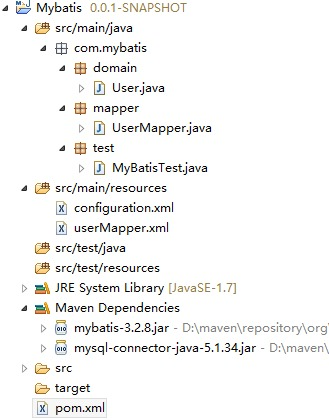

> MyBatis 是支持定制化 SQL、存储过程以及高级映射的优秀的持久层框架。
<!-- more --> 

# 什么是 MyBatis ?
MyBatis 是支持定制化 SQL、存储过程以及高级映射的优秀的持久层框架。

## MyBatis github
https://github.com/mybatis/mybatis-3
## MyBatis 文档
http://mybatis.github.io/mybatis-3/zh/index.html

# 入门程序
想要使用 MyBatis 只需将 mybatis-x.x.x.jar 文件置于 classpath 中。
如果使用 Maven 构建项目，则需将下面的 dependency 置于 pom.xml 中：
```xml
	<dependency> 
		<groupId>org.mybatis</groupId>
		<artifactId>mybatis</artifactId> 
        <version>3.8.2</version> 
	</dependency>
```

我选择第二种，在Eclipse中新建一个maven项目 
## 项目结构： 


## 各文件介绍：
- pom文件：由于使用了mySQL数据库，这里还依赖了一个mySQL驱动包

```xml
     <project xmlns="http://maven.apache.org/POM/4.0.0" xmlns:xsi="http://www.w3.org/2001/XMLSchema-instance" xsi:schemaLocation="http://maven.apache.org/POM/4.0.0 http://maven.apache.org/xsd/maven-4.0.0.xsd">  
      <modelVersion>4.0.0</modelVersion>  
      <groupId>Mybatis</groupId>  
      <artifactId>Mybatis</artifactId>  
      <version>0.0.1-SNAPSHOT</version>  
      <dependencies> 
        <dependency> 
          <groupId>org.mybatis</groupId>  
          <artifactId>mybatis</artifactId>  
          <version>3.2.8</version> 
        </dependency>  
        <dependency> 
          <groupId>mysql</groupId>  
          <artifactId>mysql-connector-java</artifactId>  
          <version>5.1.34</version> 
        </dependency> 
      </dependencies> 
     </project>
```

- 实体类User ：

```java
  package com.mybatis.domain;


    public class User {
         private String name;
         private Integer age;
         
         public String getName() {
            return name;
         }
         
         public void setName(String name) {
         this.name = name;
         }
         
         public Integer getAge() {
         return age;
         }
         
         public void setAge(Integer age) {
            this.age = age;
         }
         
    }
```

- UserMapper接口：

```java
package com.mybatis.mapper; 
import com.mybatis.domain.User; 

public interface UserMapper { 
    public User findById(String Id); 
}
```

- UserMapper接口的实现，userMapper.xml：

```xml
    <?xml version="1.0" encoding="UTF-8" ?> <!DOCTYPE mapper PUBLIC "-//mybatis.org//DTD Mapper 3.0//EN" "http://mybatis.org/dtd/mybatis-3-mapper.dtd"> <!--相当于UserMapper接口的实现 namespace必须是UserMapper类路径-->
    <mapper namespace="com.mybatis.mapper.UserMapper"> 
        <!-- findById必须和接口中的方法名一样 返回一个User--> 
        <select id="findById" parameterType="String"
        resultType="com.mybatis.domain.User"> 
        select * from user where id=#{id} 
        </select> 
    </mapper>
```


- 数据源配置 configuration.xml

```xml
    <?xml version="1.0" encoding="UTF-8" ?> 
    <!DOCTYPE configuration PUBLIC "-//mybatis.org//DTD Config 3.0//EN" "http://mybatis.org/dtd/mybatis-3-config.dtd">
    <configuration> 
        <!--数据源配置 -->
        <environments default="development"> 
            <environment id="development"> 
                <transactionManager type="jdbc" /> 
                <dataSource type="POOLED"> 
                    <property name="driver" value="com.mysql.jdbc.Driver" /> 
                    <property name="url" value="jdbc:mysql://localhost:3306/test" />
                    <property name="username" value="root" /> 
                    <property name="password" value="123456" /> 
                </dataSource>
            </environment> 
        </environments> <mappers> 
            <!--userMapper.xml装载进来 --> 
            <mapper resource="userMapper.xml" /> 
        </mappers> 
    </configuration>
```
    
- 测试类MyBatisTest：

```java
package com.mybatis.test;

import com.mybatis.domain.User;

import com.mybatis.mapper.UserMapper;

import org.apache.ibatis.io.Resources;
import org.apache.ibatis.session.SqlSession;
import org.apache.ibatis.session.SqlSessionFactory;
import org.apache.ibatis.session.SqlSessionFactoryBuilder;

import java.io.IOException;


public class MyBatisTest {
    /** * MyBatis SqlSessionFactory * SqlSessionFactory????SqlSession????????????SqlSession??????????commit?rollback?close???? * @return */ private static SqlSessionFactory getSessionFactory() {
        SqlSessionFactory sessionFactory = null;
        String resource = "configuration.xml";
        try {
            sessionFactory = new SqlSessionFactoryBuilder().build(Resources.getResourceAsReader(
                        resource));
        } catch (IOException e) {
            e.printStackTrace();
        }
        return sessionFactory;
    }

    public static void main(String[] args) {
        SqlSession sqlSession = getSessionFactory().openSession();
        UserMapper userMapper = sqlSession.getMapper(UserMapper.class);
        User user = userMapper.findById("1");
        System.out.println(user.getName());
    }
}

```


数据库中插入条数据：
id=”1” name=”wn” age=”23”

运行测试类，在控制台看到结果：wn

   

   
   