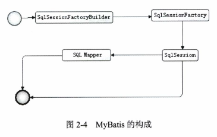

> 
# 基本构成
- SqlSessionFactoryBuilder(构造器):它会根据配置信息或者代码来生成SqlSessionFactory(工厂接口)
- SqlSessionFactory:依靠工厂来生成SqlSession(会话)
- SqlSession:是一个既可以发送SQL去执行并返回结果，也可以获取Mapper的接口
- SQL Mapper:它是Mybatis新设计的组件，它是由一个java接口和xml文件（或注解）构成的，需要给出对应的sql和映射规则，它负责发送SQL去执行，并返回结果

一张图表达他们的关联：

<!--more-->

## SqlSessionFactory
- SqlSessionFactory的实例可以通过SqlSessionFactoryBuilder获得
- SqlSessionFactory是一个工厂接口而不是实现类，它的任务是创建SqlSession,Sqlsession类似于一个JDBC的Connection对象

### Mybatis提供两种模式去创建SqlSessionFactory**
- 通过XML配置的方式，推荐这种方式，这样可以避免硬编码，还有方便日后配置人员修改
- 通过代码的方式

### Configuration类
org.apache.ibatis.session.Configuration类，他是Mybatis中将一个Configuration类对象的形式存在，而这个个对象将存在于整个Mybatis应用的生命期中，以便重复读取和运用。在内存中的数据是读取速度最快的，我们可以解析一次配置的XML文件保存到Configuration类对象中，方便我们从这个对象中服务配置信息，性能高，单例占用空间小，可以反复使用

Mybaits提供了两个SqlSessionFactory实现类，DefaultSqlSessionFactory和SqlSessionManager，不过这个SqlSessionManager目前还没有使用，目前使用的是DefaultSqlSessionFactory

他们的关系图：

### 使用XML方式构建
包含获取数据库连接实例的数据源（DataSource)、决定事务范围和控制方式的事务管理器（TransationManager）和映射器(SQL Mapper)

这里给出简单的示例

现在让我们用代码实现创建SqlSessionFactory

### 使用代码方式构建
不推荐这种方式，因为系应该环境的时候，我们不得不重新编译代码，不利于维护

## SqlSession
SqlSession是一个接口类，它类似于你们公司前台的美女客服，它扮演着门面的作用，而真正干活的Executor，你可以认为它是公司的工程师，假设我是客户找你们公司干活，我只需要告诉前台的美女客服，我要什么信息，要做什么，过段时间，她会将结果给我，我不关心工程师是怎么工作的，这个步骤对我来说是黑箱操作

### SqlSession使用方法

### SqlSession用途
- 获取映射器，让映射器通过命名空间和方法名找到对应的SQL，发送给数据库执行后返回结果
- 直接通过命名信息去执行SQL返回结果

## 映射器
映射器是由java和xml文件（或注解）共同组成的它有如下作用：
- 定义参数类型
- 描述缓存
- 描述SQL语句
- 定义查询结果和POJO对应关系

### 推荐XML文件配置方式的原因
- java注解是受限的，功能少，使用xml更加强大灵活
- 如果sql很负责，条件很多，存在动态sql的时候，写在java文件里面可读性差

### XML实现
- java接口

- xml文件

- 用sqlSession获取Mapper

### 注解方式实现

### 疑问
一个没有实现类的接口怎么能够运行呢？
其实它需要运用到java语言的动态代理来实现
mybatis会为这个接口生成代理类对象，代理对象会根据“接口全路径+方法名”去匹配，找到对象的xml文件去完成它所需要的任务，返回我们需要的结果

# 生命周期
## SqlSessionFactoryBuilder
SqlSessionFactoryBuilder是用于获得资源来构建SqlSessionFactory的，一旦我们创建了SqlSessionFactory，它的作用就已经完结，失去了存在的意义，这是我们应该废弃它，将它回收

所以它的生命周期只存在于方法的局部，它的作用就是生成SqlSessionFactory对象
## SqlSessionFactory
SqlSessionFactory的作用是创建SqlSession

所以SqlSessionFactory应该在mybatis应用的整个生命周期中

我们采取单例模式，每一个数据库只对应一个SqlSessionFactory

## SqlSession
SqlSession是一个会话

它的生命周期应该是在请求数据库处理事务的过程中，它是一个线程不安全的对象

在涉及多线程操作的时候我们需要当心，操作数据库需要注意其**隔离级别**，**数据库锁**等高级特性

我们往往通过finally语句块保证我们正确的关闭SqlSession

## Mapper
Mapper是一个接口，没有任何实现类

它应该在一个SqlSession事务方法之内，是一个方法级别的东西

## 总结

（注：内容整理自《深入浅出MyBatis技术原理与实战》）