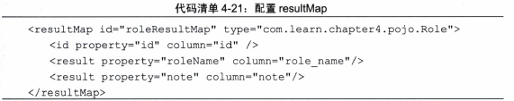

<!-- toc -->
<!-- more -->
# 映射器主要元素
- select  查询（可以自定义参数,返回结果集）
- insert 插入（执行后返回一个整数，代表插入的条数）
- update 更新 （执行后返回一个整数，代表更新的条数）
- delete 删除 （执行后返回一个整数，代表删除的条数）
- parameterMap  （定义参数映射关系，即将被删除的元素，不建议使用） 
- sql  表的列名，一次定义多个sql使用
- resultMap 从结果集中加载对象，提供映射规则
- cache 给定命名空间的缓存配置
- cache-ref 其他命名空间缓存配置
<!--more-->


# select
## 配置


## 简单例子
统计一个姓氏的用户数量，姓氏作为参数
- xml：
```
<select id="countFirstName" parameterType="string" resultType="int">
    select count(*) as total form t_user where name like concat(#{firstname},'%')
</select>
```
- 接口中方法
```
public int countFirstName(String firstName);
```

## 自动映射
参数autoMappingBehavior当它不设置为NONE的时候，Mybatis会提供自动映射功能，只要返回的sql列名和javaBean的属性一直，mybatis会帮助我们回填这些字段

自动策略可以在setting元素中的配置autoMappingBehavior属性值，包括三个值
- NONE 取消自动映射
- PARTIAL 只会自动映射，没有定义嵌套结果集映射的结果集
- FULL 会自动映射任意复杂的结果集（无论是否嵌套）

默认值为PARTIAL

如果你的数据库是规范命名的，即每一个单词都用下划线分隔，POJO采用驼峰式命名方法，那那么你也可以设置mapUnderscoreToCamelCase为true，这样就可以试实现从数据库到POJO的自动映射了

## 传递多个参数

### 使用Map传递

接口中的参数定义为：Map<String,String> params
xml中使用 resultMap='roleMap'
sql中可以直接应用map的key值比如#{roleName}

弊端：map的业务关联性不强，可读性下降

### 使用注解传递

可以使用mybatis的参数注解 **@Param**（org.apache.ibatis.annotations.Param）来实现

接口参数之前加上注解：@Param("roleName") String rolename
sql中可以直接引用参数值比如 #{roleName}

弊端：如果参数多的话，这种方式会比较复杂

### 使用JavaBean传递
mybatis允许通过javabean，简单的setter和getter方法直射参数

xml中设置
parameterType="com.xxx.Role"

这样就可以直接使用对象的参数了，例如#{roleName}

### 总结
map导致业务可读性丧失，不要使用
@Param适合参数小于等于5个时
javaBean方式适合参数大于5时

## resultMap
使用resultMap映射结果集


说明：
- id是唯一标识，type去定义它对应是哪个javabean（也可以使用别名）
- id属性标注哪个属性作为其主键
- 这样的语句不需要使用自动映射规则，直接使用resultMap属性指定roleResultMap即可，这样mybatis就会使用我们的自定义规则映射

# insert
mybaits会在执行插入之后返回一个整数，以表示你进行操作后插入的记录数

## 配置


## 主键回填和自定义
现实中有许多我们需要处理的问题，例如主键自增字段，mysql里面的主键需要根据一些特殊的规则去生成，在插入后我们往往需要获得这个主键，以便于未来的操作，mybatis提供了实现的方法

首先我们可以说使用**keyProperty**属性指定哪个是主键字段，同时使用**useGeneratedKeys**属性告诉Mybatis这个主键 是否使用数据库内置策略生成

xml配置：


这样我们传入的role对象无需设置id的值，mybatis会用数据库的设置进行处理，这样做的好处是在mybatis插入的时候，他会回填javabean的id值

如果我们需要一些特殊的关系设置id值，加入我们取消role表id自增规则，如果表t_role没用记录，则我们需要设置id=1，否则我们就取最大id加2，来设置主键

应对方法：


# update与delete
update与delete元素比较简单我们看一下配置方法


# 参数
注意:定义参数属性的时候，mybatis不允许换行

## 参数配置
有时候我们需要处理一些特殊情况，我们可以指定类型，以确定使用哪个typehandler处理他们
```
#{age,javaType=int.jdbcType=NUMERIC}

#{age,javaType=int.jdbcType=NUMERIC,typeHandler=MyTypeHandler}

设置保存的精度：
#{price,javaType=double,jdbcType=NUMERIC,numericScale=2}
```
## 存储过程支持
对于存储过程而言，存在三种参数，输入参数IN,输出参数OUT,输入输出参数（INOUT）,我们通过指定mode属性来确定其实哪一种参数，mybtis会将存储过程的返回结果这只到你制定的参数中，当你返回一个游标的时候，你还需要去设置resultMap以便mybatis将存储过程的参数映射到对应的类型

```
#{role,mode,jdbcType=CURSOR,javaType=ResultSet,resultMap=roleResultMap}
```
mybatis还支持结构体，但是当你注册参数的时候，你就需要去制定语句类型的名称

```
#{role,mode=OUT,jdbcType=STRUCT,jdbcTypeName=MY_TYPE,resultMap=roleResultMap}
```

## 特殊字符串替换和处理（#和$）
有时候我们需要传递的是sql语句本身。而不是sql所需要的参数，例如一些动态表格，需要根据不同条件产生不同动态列

例如传递变量colums="col1,clo2,col3..."给SQL,让其组装成为SQL语句，可以写成如下语句
```
select ${columns} from t_tablename
```

# sql元素
可以定于可以复用的sql语句片段
例如：
```
<sql id="role_columns"
 id,role_name,not
</sql>
```
可以在sql是使用它


# resultMap
## 元素构成


## constructor元素
加入一个pojo不存在没有参数的构造方法
它的构造方法声明为
```
public RoleBean(Integer id,String roleName)
```
那么我们就需要配置这个结果集


## 使用map存储结果集
可以设置 resultType="map" 可读性下降，不推荐使用

## 使用POJO储存结果集
最常用的的方式


## 级联
对应sql中的join操作

级联有三种：
- association 代表一对一关系 比如国民和省份证
- collection 代表一对多关系，比如班级和学生
- discrminator 是鉴别器，它可以根据实际选择采用哪个类所为实例

篇幅原因不详细说，建议少用级联，用处不大，而且会造成复杂度增加

# 缓存
## 系统缓存
mybaits对缓存提供支持，在默认情况下，它只开启一级缓存（一级缓存相对于同一个sqlSession而言）

所以在参数和sql完全一样的情况下，我们使用同一个sqlSession对象调用一个Mapper方法，往往只执行一次SQL

使用sqlSession第一次查询后，mybatis会将其放入缓存中，以后再查询的时候，如果没有声明需要刷新，而且缓存没有超时的情况下，sqlSession都只会取出当前缓存的数据，不会再次发送sql到数据库

一级缓存在sqlSession之间是互相隔离的，为了克服这个问题，我们需要配置二级缓存，在sqlSessionFactory层面提供给各个sqlSession对象共享

耳机缓存默认不开启，需要进行配置，mybatis要求返回的POJO必须是可序列化的，也就是要求实现Serializable接口

配置方法：
在xml文件中配置下面内容即可

```
<cache/>
```
很多设置是默认设置，我们只需要这样配置这个配置意味着：


我们也可以添加一些精细的配置：
```
<cache eviction='LRU' flushInterval="100000" size="1024" readOnly=true"/>
```
- evicition：缓存回收策略


- flushInterval 刷新间隔时间，单位是毫秒，如果你不配置它，那么当sql被执行的时候才会去刷新缓存
- size 引用数目，一个正整数，代码缓存最多可以储存多少个对象，不宜设置过大，会导致内存溢出
- readOnly 只读，意味着缓存数据只能读取不能修改，默认是false，不允许修改

## 自定义缓存
使用第三方缓存服务器，比如redis，我们需要mybaits为我们提供接口
org.apache.ibatis.cache.Cache

缓存接口简介


上面的接口需要我们去实现，假设我们已经有一个实现类com.learn.chapter4.MyCache
那么我们需要配置如下代码

```
<cache type="com.learn.chapter4.MyCache"/>
```

我们也可以配置sql层面上的缓存规则，来决定他们是否需要使用或者刷新缓存

我们根据两个属性：useCache和flushCache

useCache表示是否需要使用缓存
flushCache表示插入后是否需要刷新缓存

（注：内容整理自《深入浅出MyBatis技术原理与实战》）
