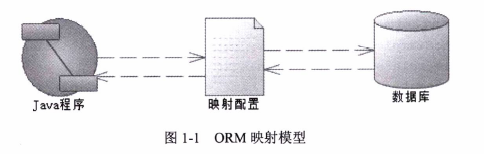
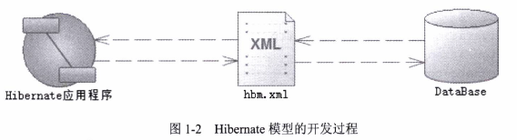
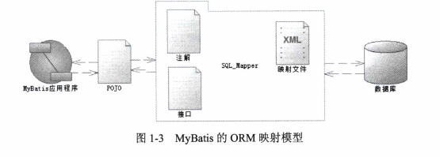

<!-- toc -->
<!-- more -->

> 主要介绍了Java ORM来源于历史，JDBC、Hibernate和MyBatis的优缺点，比较他们之间区别和应用场景

# JDBC
Java程序是通过JDBC(Java Data Base Connectivity)连接数据库的，JDBC是由SUN公司提出的一系列规范，但是它只定义了接口的规范，而具体的实现是交给了各个数据库厂商去实现的，JDBC是一种典型的桥接模式

**JDBC编程步骤**
1. 使用JDBC编程需要连接数据库，注册驱动和数据库信息
2. 操作Connection,打开Statement对象
3. 通过Statement执行SQL,返回结果到ResultSet对象
4. 使用ResultSet读取数据，然后通过代码转换为具体的POJO对象
5. 关闭数据库相关资源

**JDBC弊端**
1. 工作量大
2. 编程复杂

# ORM模型
ORM取代了JDBC,所有的ORM模型都是基于JDBC进行封装的，不同ORM模型对JDBC封装的强度是不一样的

**ORM**
对象关系映射(Object Relational Mapping),简单的说ORM框架就是数据库的表和简单Java对象的映射关系模型，我们通过这层映射关系就可以简单迅速地把数据库表的数据转化为POJO

如图

# Hibernate
Hibername一问世就成为了Java世界首选的ORM框架，它是建立在POJO和数据库表模型的直接映射关系上的

**Hibernate优势**
- 消除了代码的映射规则，它全部被分离到了XML或者注解里面去配置
- 无需再管理数据库连接，它也可以配置在XML里面
- 一个会话中，不要操作多个对象，只要操作Session对象即可
- 关闭资源只需要关闭一个Session便可

**Hibernate缺陷**
- 全表映射带来了不便，比如更新时需要发送所有的字段
- 无法根据不同的条件组装不同的SQL
- 对多表关联和复杂SQL查询支持较差，需要自己写SQL，返回后，需要自己将数据组装为POJO
- 不能有效支持存储过程
- 虽然有HQL，但是性能较差， 大型互联网系统往往需要优化SQL，而hibernate做不到

# Mybatis
为了解决Hibernate的不足，一个半自动映射的框架MyBatis应运而生

mybatis是一个java持久层框架，它封装少、高性能·可优化、维护简单等优点成为了目前java移动互联网网站服务的首选持久层框架，它特别适合分布式和大数据网络数据库编程

之所以称它为半自动，是因为它需要手工匹配提供POJO、SQL和映射关系，而全表映射的Hibernate只需要提供POJO和映射关系便可

**历史**
Mybaits的前身是Apache的一个开源项目iBatis，2010年这个项目由apache software foundation 迁移到了 google code 并且改名为Mybatis，2013年11月迁移到Github,目前mybaits是由Github维护的

**名称**
iBatis一词来源于“internet”和“abatis”的组合

mybaits所需要提供的映射文件包含以下三个部分
- SQL
- 映射规则
- POJO

**什么时候用mybaits**
- hibernate只适用于场景不太复杂，要求性能不太苛刻的时候
- mybatis拥有动态列，动态表名，存储过程支持，同时提供了简易的缓存、日志、级联，但是它的缺陷是需要你提供映射规则和sql，所以它的开发工作量比Hibernate略大一些

（注：内容整理自《深入浅出MyBatis技术原理与实战》）

