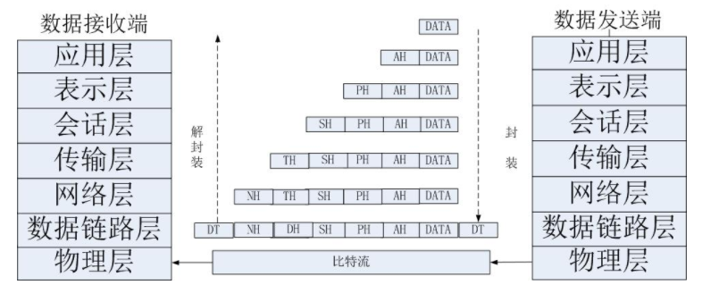
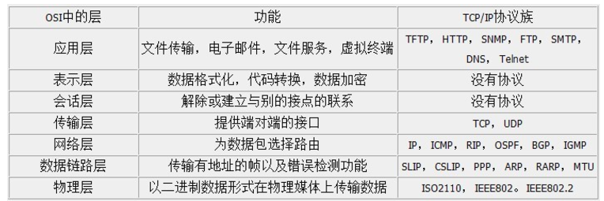

<!-- more -->

<!-- toc -->
# 网络分层
> 网络分层就是将网络节点所要完成的数据的发送或转发、打包或拆包，控制信息的加载或拆出等工作，分别由不同的硬件和软件模块去完成。这样可以将往来通信和网络互连这一复杂的问题变得较为简单。

## 五层因特网协议栈（从上到下）
- 应用层
- 传输层
- 网络层
- 链路层
- 物理层

## 五层因特网协议栈介绍
### 应用层
用于**支持支持网络应用**，运行在不同主机上的进程则使用应用层协议进行通信。主要的协议有：**http、ftp、telnet、smtp、pop3**等。
### 传输层
负责为信源和信宿提供应用程序进程间的**数据传输服务**，这一层上主要定义了两个传输协议，**传输控制协议即TCP和用户数据报协议UDP**。
### 网络层
负责**将数据报独立地从信源发送到信宿**，主要解决**路由选择、拥塞控制和网络互联**等问题。
### 数据链路层
负责将IP数据报**封装成合适在物理网络上传输的帧格式并传输**，或将从物理网络接收到的**帧解封，取出IP数据报交给网络层**。
### 物理层
负责将**比特流**在结点间传输，即负责物理传输。该层的协议既与链路有关也与传输介质有关

## 七层因特网协议栈（从上到下）
- 应用层(Application)
- 表示层(Presentation)
- 会话层(Session)
- 传输层(Transport)
- 网络层(Network)
- 数据链路层(Data Link)
- 物理层(Physical)

## 和五层结构有什么区别
个人理解五层结构就是把7层结构的 应用层/表示层/会话层 合为一个应用层

## 7层因特网协议栈介绍
### 一句话概述
- 应用层 指网络操作系统和具体的应用程序，对应WWW服务器、FTP服务器等应用软件　
- 表示层 数据语法的转换、数据的传送等　
- 会话层 建立起两端之间的会话关系，并负责数据的传送　
- 传输层 负责错误的检查与修复，以确保传送的质量，是**TCP协议**工作的地方。（报文）
- 网络层 提供了编址方案,**IP协议**工作的地方(数据包）　
- 数据链路层 将由物理层传来的未经处理的位数据包装成数据帧　
- 物理层 对应**网线、网卡、接口**等物理设备(位)。

### 物理层
物理层(Physical layer)是参考模型的最低层。该层是网络通信的数据传输介质，由连接不同结点的电缆与设备共同构成。主要功能是：**利用传输介质为数据链路层提供物理连接**，负责处理数据传输并监控数据出错率，以便数据流的透明传输。
### 数据链路层
数据链路层(Data link layer)是参考模型的第2层。 主要功能是：在物理层提供的服务基础上，在通信的实体间建立数据链路连接，**传输以“帧”为单位的数据包，并采用差错控制与流量控制方法，使有差错的物理线路变成无差错的数据链路。**
### 网络层
网络层(Network layer)是参考模型的第3层。主要功能是：为数据在结点之间传输**创建逻辑链路**，通过路由选择算法为分组通过通信子网**选择最适当的路径**，以及实现拥塞控制、网络互联等功能。
### 传输层
传输层(Transport layer)是参考模型的第4层。主要功能是向用户提供可靠的端到端(End-to-End)服务，处理数据包错误、数据包次序，以及其他一些关键传输问题。**传输层向高层屏蔽了下层数据通信的细节**，因此，它是计算机通信体系结构中关键的一层。
### 会话层
会话层(Session layer)是参考模型的第5层。主要功能是：负责维护两个结点之间的传输链接，以便**确保点到点传输不中断**，以及管理数据交换等功能。
### 表示层
表示层(Presentation layer)是参考模型的第6层。主要功能是：用于处理在两个通信系统中交换信息的表示方式，主要包括**数据格式变换、数据加密与解密、数据压缩与恢复**等功能。
### 应用层
应用层(Application layer)是参考模型的最高层。主要功能是：为应用软件提供了很多服务，例如文件服务器、数据库服务、电子邮件与其他网络软件服务。

## 总结图

# 问题汇总

## 常用的协议位于那一层
- IP协议对应于网络层
- TCP协议对应于传输
- HTTP协议对应于应用层

## TCP/IP和HTTP的关系
关于TCP/IP和HTTP协议的关系，网络有一段比较容易理解的介绍：
> “我们在传输数据时，可以只使用(传输层)TCP/IP协议，但是那样的话，如果没有应用层，便无法识别数据内容。

如果想要使传输的数据有意义，则必须使用到应用层协议。应用层协议有很多，比如HTTP、FTP、TELNET等，也可以自己定义应用层协议。WEB使用HTTP协议作应用层协议，以封装HTTP文本信息，然后使用TCP/IP做传输层协议将它发到网络上。

## Socket
**注意：**
**Socket本身并不是协议，而是一个调用接口(API)，它只是提供了一个针对TCP或者UDP编程的接口。**

socket是对**TCP/IP协议的封装和应用**,TPC/IP协议是传输层协议，主要解决数据如何在网络中传输

通过Socket，我们才能使用TCP/IP协议。实际上，Socket跟TCP/IP协议没有必然的联系。Socket编程接口在设计的时候，就希望也能适应其他的网络协议。所以说，Socket的出现只是使得程序员更方便地使用TCP/IP协议栈而已，是对TCP/IP协议的抽象，从而形成了我们知道的一些最基本的函数接口，比如create、listen、connect、accept、send、read和write等等。

## Socket和TCP/IP协议的关系
网络有一段关于socket和TCP/IP协议关系的说法比较容易理解：
> “TCP/IP只是一个协议栈，就像操作系统的运行机制一样，必须要具体实现，同时还要提供对外的操作接。
这个就像操作系统会提供标准的编程接口，比如win32编程接口一样，
TCP/IP也要提供可供程序员做网络开发所用的接口，这就是Socket编程接口。”

## HTTP和Socket的关系
CSDN上有个比较形象的描述：
> HTTP是轿车，提供了封装或者显示数据的具体形式;Socket是发动机，提供了网络通信的能力。

## 利用Socket建立网络连接的步骤
　　建立Socket连接至少需要一对套接字，其中一个运行于客户端，称为ClientSocket ，另一个运行于服务器端，称为ServerSocket 。
　　套接字之间的连接过程分为三个步骤：**服务器监听，客户端请求，连接确认**。
　　1、服务器监听：服务器端套接字并不定位具体的客户端套接字，而是处于等待连接的状态，实时监控网络状态，等待客户端的连接请求。
　　2、客户端请求：指客户端的套接字提出连接请求，要连接的目标是服务器端的套接字。
　　为此，客户端的套接字必须首先描述它要连接的服务器的套接字，指出服务器端套接字的**地址和端口号**，然后就向服务器端套接字提出连接请求。
　　3、连接确认：当服务器端套接字监听到或者说接收到客户端套接字的连接请求时，就响应客户端套接字的请求，建立一个新的线程，把服务器端套接字的描述发给客户端，一旦客户端确认了此描述，双方就正式建立连接。
　　而服务器端套接字继续处于监听状态，继续接收其他客户端套接字的连接请求。

## HTTP链接的特点
　　HTTP协议即超文本传送协议(Hypertext Transfer Protocol )，是Web联网的基础，也是手机联网常用的协议之一，HTTP协议是建立在TCP协议之上的一种应用。
　　HTTP连接最显著的特点是客户端发送的每次请求都需要服务器回送响应，在请求结束后，会主动释放连接。从建立连接到关闭连接的过程称为“一次连接”。

## TCP和UDP的区别
　　1、**TCP是面向链接的**，虽然说网络的不安全不稳定特性决定了多少次握手都不能保证连接的可靠性，但TCP的三次握手在最低限度上(实际上也很大程度上保证了)保证了连接的可靠性;
　**　而UDP不是面向连接的，UDP传送数据前并不与对方建立连接，对接收到的数据也不发送确认信号，发送端不知道数据是否会正确接收，当然也不用重发，所以说UDP是无连接的、不可靠的一种数据传输协议**。
　　2、也正由于1所说的特点，使得UDP的开销更小数据传输速率更高，因为不必进行收发数据的确认，所以UDP的实时性更好。
　　知道了TCP和UDP的区别，就不难理解为何采用TCP传输协议的MSN比采用UDP的QQ传输文件慢了，但并不能说QQ的通信是不安全的，
　　因为程序员可以手动对UDP的数据收发进行验证，比如发送方对每个数据包进行编号然后由接收方进行验证啊什么的，
　　即使是这样，UDP因为在底层协议的封装上没有采用类似TCP的“三次握手”而实现了TCP所无法达到的传输效率。