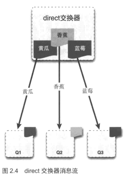
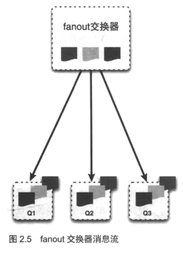
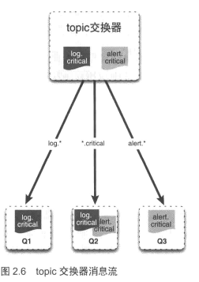

<!-- toc -->
<!-- more -->

# 交换器和绑定

当你想要将消息投递到队列时，你通过把消息发送给**交换器**来完成。然后，根据确定的规则，RabbitMQ将会决定消息该投递到哪个队列，这些规则被称为**路由键(routing key)**。**队列通过路由键绑定到交换器**，当你把消息发送到代理服务器时，消息将拥有一个路由键（即使是空的）
Rabbit也会将其和绑定使用的路由键进行匹配，如果匹配的话，那么消息将会投递到队列，如果路由的消息不匹配任何绑定模式的话，消息将进入“黑洞”

<!--more-->

## 为什么大费周章使用这种交换器和绑定？
- 这样可以满足更多复制的使用场景，利于发布\订阅或者多播
- 对于发送消息给服务器的发布者来说，它不需要关心服务器的另一端（即队列和消费者）

## 交换器类型
- direct 
- fanout 
- topic 
- headers

每一种类型实现了不同的路由算法

### direct
非常简单，如果路由键匹配的话，消息就会被投递到对应的队列

服务器必须实现direct类型交换器，包含一个**空白字符串**名称的默认交换器，当声明一个队列时，他会自动绑定到默认交换器，并以队列名称作为路由键。
你可以使用如下代码发送消息到之前声明的队列去，前提是你已经获得了信道实例：

    $channel->basic_publish($msg,'','queue-name');

第一个参数是你想要发送的消息内容，第二个参数是一个空字符串，指定了默认交换器，第三个参数是路由键

当默认的direct交换器无法满足你的需求是，你可以声明你自己的交换器，只需要发送exchange.declare命令并设置合适的菜蔬就行了

### fanout
这种类型的交换器会将收到的消息广播到绑定的队列上

当你发送一条消息到fanout交换器时，他会把消息投递给所有附加在此交换器的队列，这允许你对单条消息做不同的反应

举个例子：
一个web应用可能需要在用户上传新的图片时做几件事情：
- 用户相册清除缓存
- 用户得到积分奖励

你可以将两个队列绑定到图中的交换器上，一个用于清楚缓存，一个用于积分奖励

使用fanout交换器，你唯一需要做的就是为新的消费者写一段代码，然后声明新的队列并将其绑定到fanout交换器上，而不用修改发送方的代码

### topic
这类交换器允许你实现有趣的消息通信场景，它使得来自不同源头的消息能够到达同一个队列

让我们以web应用程序日志系统作为示例
你拥有不同的日志级别 例如：error info 和warning
你的程序拥有以下几个模块：user-profile,image-gallery,msg-inbox等

如果在发送消息的动作失败时，你想要报告一个error的话，则可以编写以下代码

    $channel-> basic_publish($msg,'logs-exchange','error.msg-inbox');

然后你声明了一个msg-inbox-errors队列，你可以将其绑定到交换器来接收消息

    $channel->queue_bind('msg-inbox-errors','logs-exchange','error.msg-inbox');
    
目前为止，看起来和使用direct交换器很像
**但是如果你想要一个队列监听msg-inbox模块的所有级别的话，你该怎么做？**
你可以通过将新的队列绑定到已有的同一个交换器来实现就像下面这样：

    $channel->queue_bind('msg-inbox-logs','logs-exchange','*.msg-inbox');
    
msg-index-logs队列将会接收从msg-inbox模块发来的所有error，warning和info日志

**通配符**
- 单个“.”把路由键分为几部分
- “*”匹配特定位置的任意文本
- “*”操作符将“.”视为分隔符，“#”操作符没有分块的概念，它将任意"."字符均视为关键词的匹配部分

为了实现匹配所有规则，你可以使用“#”

    $channel->queue_bind('all-log','log-exchage',‘#’)

### headers
允许你匹配AMQP消息的header而非路由键，除此之外，和direct交换器完全一致，但是性能差很多，因此它并不实用，而且几乎用不到

我们已经理解了这几种交换器类型，并能体会AMQP的强大之处了，你可以对服务器的行为编程以满足自己的需求，它既能够以发布\订阅模式的设置方式作为队列服务器使用，也可以作为RPC服务器使用

# 总结
- AMQP架构中最关键的几个组件分别是 交换器 队列和绑定
- 根据绑定规则将队列绑定到交换器上
- 消息是发布到交换器上的
- 有四种类型的交换器 - direct fanout topic  headers
- 基于消息的路由键和交换器类型，服务器会决定将消息投递到哪个队列去

（注：内容整理自《Rabbit实战》）