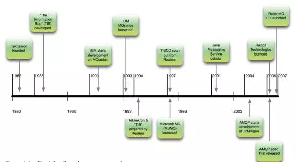

> RabbitMQ是一个开源的消息代理和队列服务器，用来通过普通协议在完全不同的应用之间共享数据，或者简单地将作业队列以便让分布式服务器进行处理

# RabbitMQ概述
RabbitMQ是一个开源的消息代理和队列服务器，用来通过普通协议在完全不同的应用之间共享数据，或者简单地将作业队列以便让分布式服务器进行处理

<!--more-->

它现实了AMQP协议，并且遵循Mozilla Public License开源协议，它支持多种语言，可以方便的和spring集成

消息队列使用消息将应用程序连接起来，这些消息通过像RabbitMQ这样的消息代理服务器在应用程序之间路由

## 消息通信起源
- **Teknekron**
1983年一位来自孟买的26岁工程师脑海中浮现了一个激进的想法：**为什么没有一种通用的软件“总线”--一种通信系统，可以解决程序间繁重的信息通信工作呢？**来自MIT的硬件设计教育工作者Vivek Ranadive设想了一种通用的软件总线，就想主板上的总线那样，供其他应用程序接入，在1983年，Teknekron诞生了
- **TIB**
随后，诞生了世界上第一个现代消息队列软件：The information bus
- **IBM MQ/MSMQ**
20世纪80年代后期，IBM开始研究开发自己的消息队列软件，IBM MQ产品系列问世
同时期，微软也在消息通信市场崭露头角，MSMQ
- **JMS**
中小技术公司对**高价格**MQ供应商表示不满，金融服务公司也对此激动不起来，为了解决这个问题，Java Message Servive在2001年诞生了**，JMS只需要针对JMS API编程，选择合适的MQ驱动即可，JMS会打理好其他部分**，问题是你在尝试使用单独接口标准化来胶合众多不同的接口，就想把不同类型的衣服黏在一起，缝合处终究会裂开，使用JMS的应用程序会变得更加脆弱，**我们需要新的消息通信标准化方案**

## 救世主AMQP
AMQP:advanced Message Queuing Protocol(高级消息队列协议)
2004年开发
从一开始就设计成为开发标准，以解决众多的消息队列需求和拓扑结构问题
凭借开放，任何人都可以执行这一标准，针对标准编码的任何人都可以和任意AMQP供应商提供的MQ服务器进行交互

## 消息队列简史

## 关于为什么叫Rabbit
兔子是行动非常迅速的动物而且繁殖起来也非常疯狂

## 为什么选择RabbitMQ 
- 除了Qpid外，**Rabbit是唯一实现了AMQP标准的代理服务器**
- 正是由于Erlang，**RabbitMQ集群不可思议的简单**
- 比竞争对手更**可靠**，更能防止奔溃

（注：内容整理自《RabbitMQ实战》）

