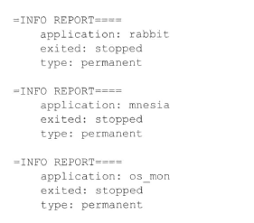
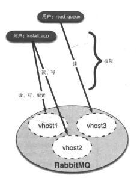
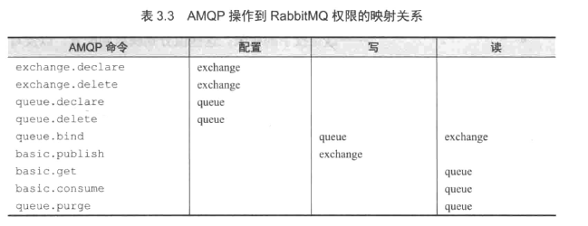
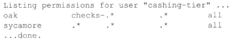
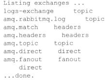

<!-- toc -->
<!-- more -->


# 服务器管理
## 概述
RabbitMQ是使用Erlang编写的

<!--more-->

Erlang天生就能够让应用程序无须知道对方是否在同一个机器上即可互相通信，这让RabbitMQ集群和可靠的消息路由变得简单

为了达到“简单分布式”，需要两个你可能不太熟悉的概念：**Erlang节点和Erlang应用程序**
如果你熟悉java虚拟机（jvm）的话，两者是很相似的


## 启动节点
**节点**
节点用来指代RabbitMQ服务器实例，事实上，节点描述的是一个Erlang节点运行着一个Erlang应用程序

当你运行java程序时，JVM的一个实例就启动了，并且开始执行指定的java程序，与之相似，Erlang也有虚拟机，而虚拟机的每个实例我们称之为**节点(node)**

不同与JVM,多个Erlang应用程序可以运行在用一个节点之上，更重要的是，节点之间可以进行本地通信

当我们谈到RabbitMQ节点时，我们指的是**RabbitMQ应用程序和其所有的Erlang节点**

**启动方法**
在RabbitMQ安装目录下找到./sbin目录，运行

```
./rabbitmq-server
```
当查看控制台，你会发现不同的RabbitMQ子系统运行起来了，并准备好处理消息

**日志**
/var/log/rabbitmq目录下找到名为rabbit@[hostname].log日志文件

**-detached**

```
./rabbitmq-server -detached
```
怎么这个启动参数，以守护程序的方式在后台运行

## 停止节点
两种方式：**干净的方式和肮脏的方式**

**肮脏的方式**
当运行RabbitMQ控制台时，按下CTRL-C可以看到以下内容：

```
BREAK: (a)bort (c)ountinue (p)roc info (i)nfo (l)oaded
       (v)ersion (k)ill (D)b-tables (d)istribution
```
想要关闭整个节点，选择abort就是你要的答案，但是有更好的方法来停止RabbitMQ

**干净的方式**
这种方法会通知RabbitMQ干净地关闭，并保护好那些持久化队列，运行：

```
./sbin/rabbitmqctl stop
```
rabbitmqctl会和本地节点通信并指示其干净的关闭，你可以指定关闭不同的节点，包括远程节点，只需要传入 **-n rabbit@[hostname]** 即可

在RabbitMQ日志中会看到以下内容：

当看到rabbit,mnesia和os_mon停止了，Rabbit节点也就完全关闭了

**关闭和重启的程序的差异**
有时候你只想重启RabbitMQ应用程序，而同时保持Erlang节点运行，对集群来说，这种做法是必须的，因为你可能会在同一节点运行除了RabbitMQ之外的其他Erlang应用程序，这使得停止整个节点时不可取的

停止RabbitMQ，只需要运行：

```
./rabbitmqctl stop_app
```

**Rabbit配置文件**
RabbitMQ允许你设置系统范围的可调参数并通过配置文件进行设置

该配置文件位于：/etc/rabbitmq/rabbitmq.config

文件位置可以通过rabbitmq-server脚本对CONFIG_FILE环境变量进行设置

你会发现，rabbitmq.config的文件格式有点吓人：

```
[ {mnesia,[{dump_log_threshold, 1000}]},
{rabbit,[{vm_memory_hifgh_watermark,0.4}]}].
```
RabbitMQ配置文件事实上是一个包含嵌套哈希表的数组

mnesia指的是Mnesia数据库配置选项（Mnesia是RabbitMQ用来储存交换器和队列元数据的）
rabbit值得是RabbitMQ特定的配置选项，每个选项都表达为这种形式：{[option_name],[option_value]}

RabbitMQ中的每个队列，交换器和绑定的元数据（除了消息内容）都保存到Mnesia，Mnesia是内建在Erlang的非SQL型数据库

**Mnesia配置选项**
- dump_log_write_threshold 默认值100 ，将全新追加的日志内容刷新/转储至真实数据库文件的频度


*Rabbit配置项*
- tcp_listeners   
定义了RabbitMQ应该监听的非SSL加密通信的ip和端口
默认值[{"0.0.0.0",5672},]  

- ssl_listeners
{"ip地址"，端口号}数组 
定义了RabbitMQ应该监听的SSL加密通信的ip和端口
默认空

- ssl_options
{"键"，值}数组
指定ssl相关的选择，有效的选项有 cacertfile（CA证书文件）、certfile(服务器证书文件)、keyfile（服务器秘钥文件）和fail_if_no_prrt_cert(需要客户端安装有效证书:True/false)

- vm_memory_high_watermark
控制Rabbit允许消耗的内存 0.4=40%
默认值0.4

- msg_store_file_size_limit 
RabbitMQ垃圾收集储存内容之前，消息存储数据库的最大大小
单位是字节
默认值16777216

-queue_index_max_journal_entries 
在转储到消息储存数据库并提交之前，消息储存日志的最大条目数
默认 262144

# 权限设置
RabbitMQ权限工作原理：用户可以为链接到RabbitMQ主机的应用程序设置不同级别的权限（读、写、和/或配置）



RabbitMQ权限系统的一个好的地方在于单个用户可以跨越多个vhost进行授权

## 管理用户
用户是访问控制的基本单元，针对一到多个vhost，其可以被赋予不同级别的访问权限，并使用标准的用户名/密码来认证用户

**添加用户**

```
./rabbitmqctl add_user cashing-tier cashMel
```
输出：

```
Creating user "cashing-tier" ...
...done
```

**删除用户**

```
./rabbitmqctl delete_user cashing_tier
```
输出：

```
Deleting user "cashing-tier"
...done
```
注意：当你删除用户的时候，任何引用该用户的访问控制条目都会从Rabbit权限数据库中自动删除，同时，rabbbitmqctl也不会警告你与用户相关的访问控制条目也会一并被删除

**查看当前存在哪些用户**

```
./rabbitmqctl list_users
```
输出

```
Listing users ..
cashing-tier
guest
...done
```

**修改用户的密码**

```
./rabbitmqctl change_password cashing-tier coml3xPassword
```
输出

```
Changeing password for user "cashing-tier" ...
...done
```

## RabbitMQ权限系统
从1.6.0版本开始，RabbitMQ实现了一套访问控制列表（ACL）风格的权限系统，新的权限系统允许大量细粒度控制，同时可以授予用户读、写、和配置选项，这三者有何差异？
- 读--有关消费信息的任何操作，包括“清除”整个队列
- 写--发布消息（同样需要绑定操作的成功）
- 配置--队列和交换器的创建和删除


下图展示了不同AMQP命令的列表和对应的权限


每一条访问控制条目由以下四部分组成：
- 被授予访问权限的用户
- 权限控制应用的vhost
- 原药授予的读/写/配置权限的组合
- 权限范围

注意：访问控制条目是无法跨越vhost的，加入你想给用户cashing-tier在vhost oak和vhost sycamore上赋予相同权限，那么你必须穿件两份访问控制条目

例子：假设你有名为sycamore的vhost,你想要授予cashing-tier完全的访问权限（配置、写和读权限），你需要rabbitmqctl的**set_permissions**命令完成

```
./rabbitmqctl set_permissions -p sycamore \
cashing-tier ".*"".*"".*"
```
输出：

```
Setting permisssion for user "cashing-tier" in vhost "sycamore ...
...done
```
解释：
- -p sycamore  这告诉set_permissions条目应该应用在那个vhost上
- cashing-tier 被授予权限的用户
- ".*"".*"".*" 这是授予的权限，分别映射到配置、写、读

权限值中三个值都是正则表达式，".*"指代所有权限，以为这匹配任何队列或交换器的名字

**删除权限**

```
.rabbitmqctl clear_permissions -p oak cashing-tier
```
输出

```
Clearing permissions for user "cashing-tier" in vhost "oak"...
...done
```

**查看用户在RabbitMQ服务器所有vhost上的权限**

```
./rabbitmq list_user_permissons cashing-tier
```
输出：



# 使用统计
**列出队列和消息数目**

```
./rabbitmqctl list_queues
```
输出：

```
Listing queues ...
msg-inbox-logs 0
msg-inbox-errors 0
all-logs 3
...done
```
这些都是默认vhost的信息。如果想要获取另一个vhost的话，可以使用：

```
./rabbitmqctl list_queues -p sycamore
```

**如果运行rabbitmqctl命令二不携带任何选项的话，就会展示帮助信息**

**查看交换器和绑定**

```
./rabbitmqctl list_exchanges
```
输出：


你会发现若干个交换器早已经声明好了，例如amq.topic,amq.ditect和amq.fanout,AMQP规范里面对这些交换器有规定

只有一个direct类型而没有交换器名称，这就是匿名交换器，每个队列默认绑定到该交换器

（注：内容整理自《RabbitMQ实战》）

