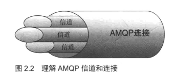

<!-- toc -->
<!-- more -->

# 消费者和生产者

## 生产者
生产者创建消息，然后发布到代理服务器

<!--more-->

## 消息
什么是消息呢？ 
消息包含两部分：**有效载荷（payload）和标签（label）**

- **有效负荷**
就是你想要传输的数据，它可以试任何内容，一个json数组或者是你最喜欢的mp4，Rabbitmq不会在意这些

- **标签**
描述了有效载荷，并且RabbitMQ用它来决定谁将获得消息的拷贝
举例来说：不同于TCP协议，当你明确指定发送方和接收方时，AMQP只会用标签表述这条信息，然后把消息交由Rabbit，Rabbit会根据标签把消息发送给感兴趣的接收方，这种通信方式是一种**“发后即忘(fire-and-forget)”**的单项方式

## 消费者
消费者很容易理解，他们连接到代理服务器上，并订阅到队列上，把消息想象成一个具名邮箱，每当消息到达特定邮箱时，RabbitMQ会将其发送给其中一个订阅的/监听消费者

当消费者接受到消息是，它只得到消息的一部分：有效载荷

## 信道
你必须首先连接到Rabbit，才能消费或者发布消息，你在应用程序和Rabbit代理服务器之间创建一条TCP连接，一旦TCP连接打开，应用程序就可以创建一条AMQP信道

信道是建立在“真实的”tcp连接内的虚拟连接

**为什么不直接通过TCP连接发送AMQP命令？**
主要原因是对于操作系统来说建立和销毁TCP会话是非常昂贵的开销

如果我们为所有线程只使用一条TCP连接，但又确保每个线程的私密性，就像拥有独立连接一样的话，那不就非常完美了

线程启动后会在现成的连接上创建一条信道，也就获得了连接Rabbit上的私密通信路径，而不会给操作系统的TCP栈造成额外负担，在一条TCP连接上创建多少条信道是没有限制的，把它想象成一束光纤电缆就可以了

有了AMQP,你可以灵活的使用多个信道来满足应用程序的需求，而不会有众多tcp连接的开销

# 总结

消息通信，特别是AMQP,可以被当做**加强版的传输层**

当你理解了这些概念，你就吧RabbitMQ看做**软件的路由器**了

（注：内容整理自《RabbitMQ实战》）