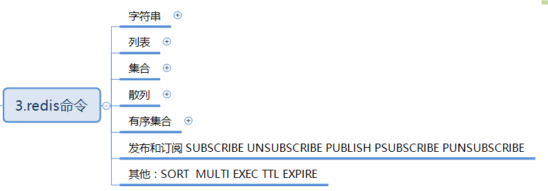
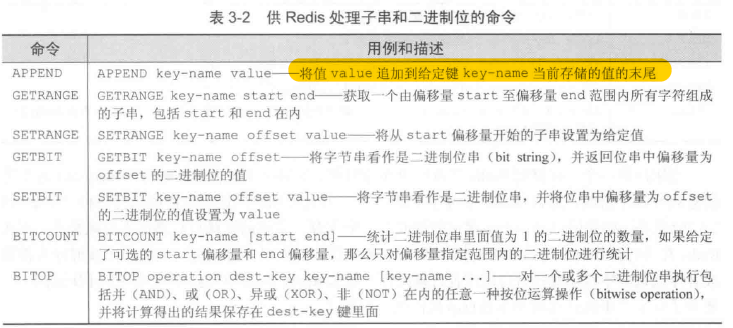
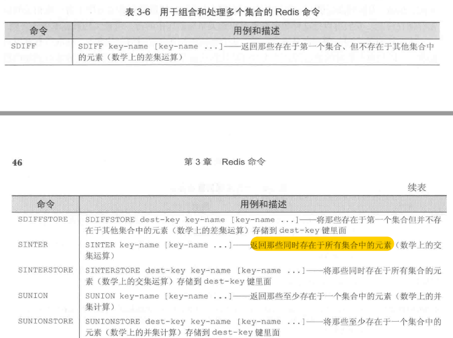
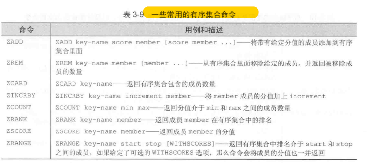
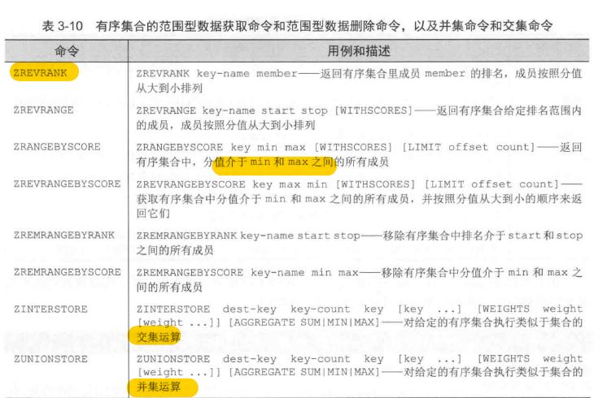

>字符串 列表 集合 散列 有序集合

<!-- more -->

## 字符串
### 字符串可以存储：字节串（btye string），整数，浮点数

### 自增自减命令
`INCR key-name` 将键储存的值加上1 

`DECR key-name` 将储存的值减去1 

`INCRBY key-name amount`          将键储存的值加上整数amount 

`DECRBY key-name amount`               将键储存的值减去整数amount         

`INCRBYFLOAT key-name amount` 将键储存的值加上浮点数amount，这个命令在redis2.6或者以上的版本可用

### redis还拥有对字符串其中一部分内容进行读取或者写入的操作

 
## 列表
`RPUSH key-name value[value...]`--将一个或者多个值推入列表的右端，（LPUSH 是推入左端） 

`RPOP key-name` 移除并返回列表最右端的元素（LPOP 是左边） 

`LINDEX key-name offset` 返回列表中的偏移量为offset的元素

`LRANGE key-name start end` 返回列表从start偏移量到end偏移量范围内的所有元素

`LTRIM key-name start end` 对列表进行修剪，只保存从start到end范围的元素。start和end也会被保留

## 集合
`SADD SADD key-name item[item...]` 将一个或多个元素添加到集合里面，并返回被添加元素当中原本并不存在与集合里面的元素数量  

`SREM key-name item[item...] ` 从集合里面移除一或多个元素，并返回被移除元素的数量 

`SISMEMBER SISMEMBER key-name` item[item...]检查元素item是否存在于集合key-name里  

`SCARD SCARD key-name` 返回集合包含的元素的数量 

`SMEMBERS SMEMBER` 
key-name 返回集合包含的所有元素 

`SRANDMEMBER SRANDMEMBER` key-name[count]-从集合里面随机地返回一个或多个元素，当count为正数时，命令返回的元素不会重复，当为负数是，命令返回的元素可能会重复 SPOP 
`SPOP key-name` 随机地移除集合中的一个元素，并返回被移除的元素 

`SMOVE SMOVE source-key dest-key item` 如果集合soucre-key包含元素item，那么从集合source-key里面移除元素item。并将元素item添加到集合dest-key中，如果item被成功移除，返回1.否则返回0

## 散列
`HMGET key-name key[key...]` 从散列里面获取一个或对个键的值 

`HMSET key-name key value [key value..]` 为散列里面的一个或多个键设置值 

`HDEL key-name key[key` ...]删除散列里面的一个或多个键值对，返回成功找到并删除键值对数量 

`HLEN key-name` 
返回散列包含的键值对的数量  

### 进阶：
`HEXISTS key-name key` 检查给定键是否存在于散列中 

`HKEYS key-name` 
获取散列包含的所有键 

`HVALS key-name`
获取散列包含的所有值 

`HGETALL key-name` 
获取散列包含的所有键值对 

`HINCRBY key-name key increment` 将键存储的值加上整数increment 

`HINCRBYFLOAT key-name key increment` 将键key存储的值加上浮点数increment

## 有序集合

## 发布和订阅
`SUBSCRIBE `
`UNSUBSCRIBE `
`PUBLISH `
`PSUBSCRIBE `
`PUNSUBSCRIBE`

## 其他命令
`SORT`
`MULTI`
`EXEC `
`TTL `
`EXPIRE`

（注：内容整理自《redis实战》）