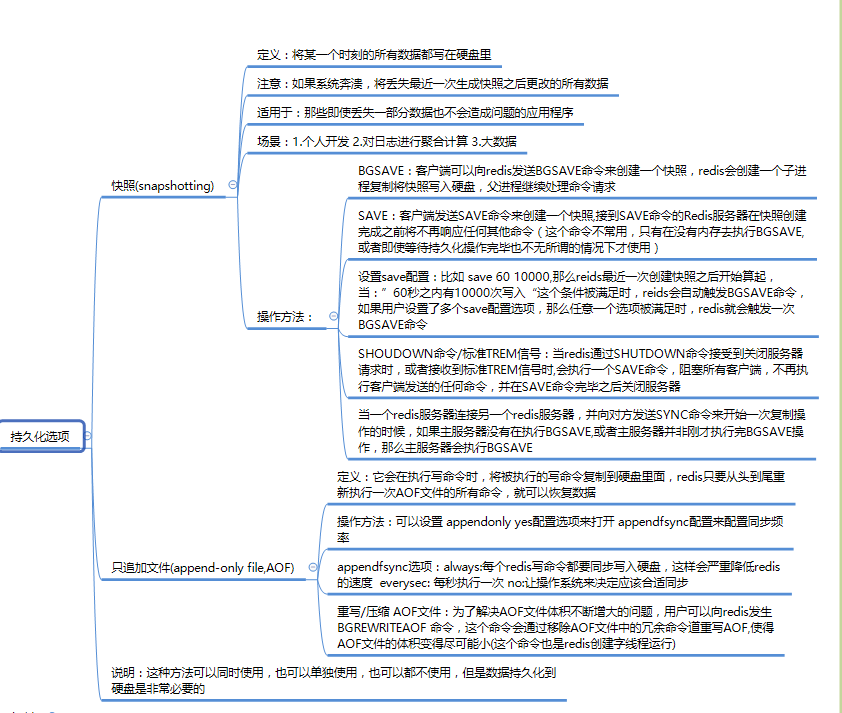
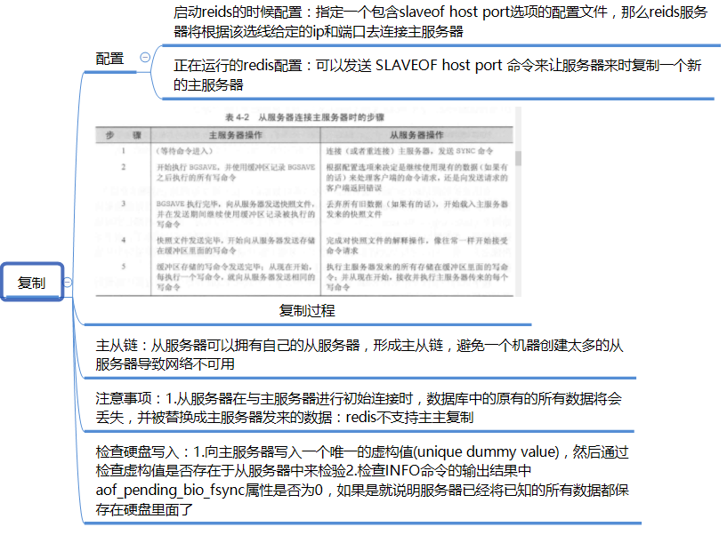
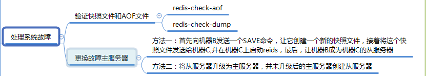
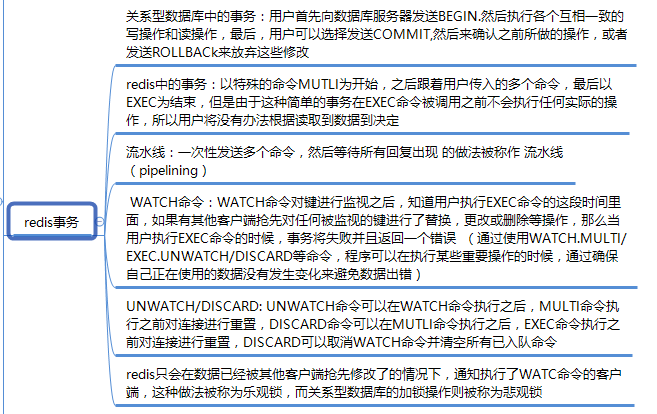

<!-- more -->
## 持久化选项

## 复制

## 处理系统故障

## redis事务

## 非事务型流水线
可以接受多个参数的添加命令和更新命令，比如：MGET,MSET,HMGET,HMSET,RPUSH,LPUSH,SADD,ZADD,这些命令简化了那些需要重复执行相同命令的操作，而极大的提升了性能
## 性能方面注意事项
可以用性能测试程序redis-benchmark来测试

（注：内容整理自《redis实战》）