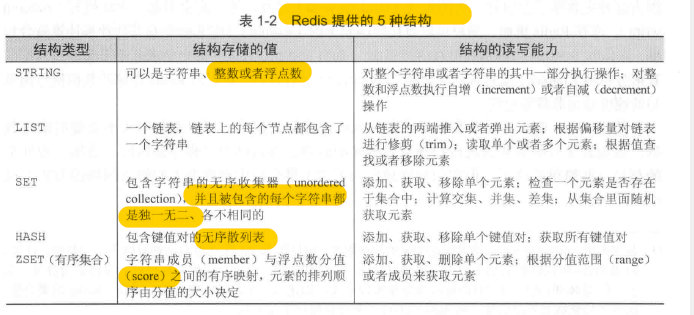

> redis是一个速度非常快的非关系数据库，他可以存储键与5种不同类型的值之间的映射，可以将储存在内存的键值对持久化到硬盘，可以使用复制特性来扩展读性能，还可以使用客户端分片来扩展读性能

<!-- more --> 
### reids简介
redis是一个速度非常快的非关系数据库，他可以存储键与5种不同类型的值之间的映射，可以将储存在内存的键值对持久化到硬盘，可以使用复制特性来扩展读性能，还可以使用客户端分片来扩展读性能

### redis与memcached的区别
两者都可以用于储存键值映射，彼此的性能也相差无几，但是redis能够自动以两种方式将数据写入硬盘，并且redis除了能存储普通字符串之外，还可以储存其他4种数据结构

### redis拥有两种不同形式的持久化方法
他们都可以用小而紧凑的格式将储存在内存中的数据写入硬盘吗，第一种方法是时间点转储，转储既可以在"指定时间段内有指定数量的写操作执行"这一条件被满足时执行，又可以通过调用两条转储到硬盘的命令中的任何一条来执行，第二种持久化方法将所有修改了数据库的命令都写入一个只追加文件里面，用户可以根据数据的重要程度，将只追加写入设置为从不同步，每秒同步一次或者没写入一个命令就同步一次

### 数据结构

### STRING  
*基本命令*：GET SET DEL  
*进阶*：自增 自减

### LIST 
*基本命令*：RPUSH LRANGE LINDEX LPOP *进阶*：从列表里面移除元素，将元素插入列表中间，将列表修剪至指定长度

### SET  
LIST可以存储多个相同的字符串，而SET则可以通过散列来保证自己存储的每个字符串都是各部相同的  set使用无序的方式储存  
*基本命令*：SADD SMEMBER SISMEMBER SREM 
*进阶*：SINTER SUNION SDIFF

### HASH 
储存的值既可以是字符串也可以是数字值，并且用户同样可以对散列储存的数字值执行自增操作或者自减操作  散列在很多方面就想一个微缩版的redis  
*基本命令*：HSET HGET HGETALL HDEL

### ZSET 
有序集合的值被称为分值，分值必须是浮点数，有序集合是redis里面为一个既可以根据成员访问，也可以根据分值以及分值的排列顺序来访问元素的结构 
*基本命令*：ZADD ZRANGE ZRANGEBYSCORE ZREM

（注：内容整理自《redis实战》）
