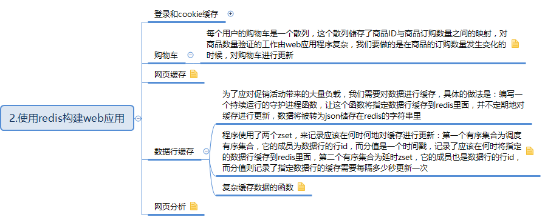
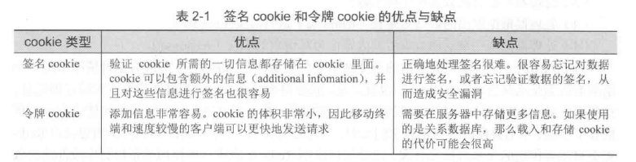

## 目录


## 登录和cookie缓存
cookie：当我们登录互联网服务的时候，这些服务都会使用cookie来记录我们的身份，cookie由少量数据组成，网站会要求我们的浏览器存储这些数据，并在每次服务发生请求时将这些数据传回给服务

对于用来登录的cookie，有两种方法可以将登录信息储存在cookie里面，一种是签名（signed）cookie一种是令牌（token）cookie

<!-- more -->

签名cookie通常会储存用户名，还可能有用户ID，用户最后一次成功登录的时间，以及网站觉得有用的其他信息，除此之外，cookie还会包含一个签名，服务器可以用它来验证浏览器发生的信息是否被改动（比如cookie中的登录用户名改成另一个用户）

令牌cookie会在cookie里面储存一串随机字节作为令牌，服务器可以根据令牌在数据库中查找令牌的拥有者，随着时间的推移，旧令牌会被新令牌取代

 

redis实现令牌登录cookie：首先，我们将使用一个hash来储存登录cookie令牌和已登录用户之间的映射，要检查一个用户是否已经登录，需要根据给定的令牌来查找与之对应的用户，并在用户已经登录的情况下，返回该用户的id

尝试获取并返回令牌对应的用户
```python
def check_token(conn,token):
	return conn.hget('login:',token)
```

更新令牌：用户每次浏览页面的时候，程序都会对用户存储在登录hash里面的信息进行更新，并将用户的令牌和当前时间戳添加到记录最近登录用户的有序集合里面，如果用户正在浏览一个商品页面，那么程序还会将这个商品添加到记录这个用户最近浏览过的商品的有序集合里面，并在被记录的商品的数量超过25个时，对这个有序集合进行修剪

```python
    def update_token(conn,token,user,item=None):
	    timestamp = time.time()  //获取当前时间戳
    	conn.hset('login:',token,user) //维持令牌与用户之间的映射
    	conn.zadd('recent',token,timestamp)//记录令牌最后一次出现的时间
        	if item：
	        	conn.zadd('viewed:'+token,item,timestamp) //记录用户浏览过的商品
		        conn.zremrangebyrank('viewed:'+token,0,-26)//移除旧的记录，只保存用户浏览过的25个商品
```

		        
储存会话的数据所需的内存会随着时间的推移不断增加，需要清理旧数据，只保存1000万个，清理程序是一个循环，检查集合的大小，超过了限制就移除最多100个旧令牌，并移除记录用户信息的hash信息，并清除浏览信息。如果没有要清理的，休眠1秒，在检查(附：使用redis过期时间，就可以在一段时间之后让redis自动删除他们)

```python
    QUIT = False
    LIMIT = 10000000

    def clean_sessions(conn):
    	while not QUIT:
		//找出目前已有令牌的数量
		size = conn.zcard('recent:')  
		//令牌数量未超过限制，休眠并在之后重新检查
		if size <= LIMIT:
			time.sleep(1)
			continue
		//获取需要移除的令牌id
		end_index = min(size-LIMIT,100)
		tokens = conn.zrange('recent:',0,end_index-1)
		//为那些要被删除的令牌构建键名
		session_keys = []
 		for token in tokens:
			session_keys.append(‘viewed:’+token)
		//移除旧的那些令牌
		conn,delete(*session_keys)
		conn.hdel('login:',*tokens)
		conn.zrem('recent',*tokens)
```


## 购物车
每个用户的购物车是一个散列，这个散列储存了商品ID与商品订购数量之间的映射，对商品数量验证的工作由web应用程序复杂，我们要做的是在商品的订购数量发生变化的时候，对购物车进行更新
```python
        def add_to_cart(conn,session,count)
	    if count <=0;
		    conn.hrem('cart:'+session,item)
	    else
		    conn.hset('cart:'+session,item,count)
```

		    
		    
## 网页缓存
```python
    def cache_request(conn,request,callback):
	    //对于不用背缓存的请求，直接调用回调函数
	    if not can_cache(conn,request);
		    return callback(request)
	    //将请求装换成一个简单的字符串建。方便之后进	行查找
	    page_key = 'cache:'+hash_request(request)
	    //查找被缓存的页面
	    content = conn.get(request)
	    //如果页面还没有被缓存，那么生成页面
	    if not content:
		    content=callback(request)
		    //将新生成的页面放到缓存里
		    conn.setex(page_key,content,300)
	    return content
```

	

## 数据行缓存
为了应对促销活动带来的大量负载，我们需要对数据进行缓存，具体的做法是：编写一个持续运行的守护进程函数，让这个函数将指定数据行缓存到redis里面，并不定期地对缓存进行更新，数据将被转为json储存在redis的字符串里

程序使用了两个zset，来记录应该在何时何地对缓存进行更新：第一个有序集合为调度有序集合，它的成员为数据行的行id，而分值是一个时间戳，记录了应该在何时将指定的数据行缓存到redis里面，第二个有序集合为延时zset，它的成员也是数据行的行id，而分值则记录了指定数据行的缓存需要每隔多少秒更新一次

调度缓存和终止缓存的函数
```python
    def schedule_row_cache(conn,row_id,delay):
	    //先设置数据行的延迟值
	    conn.zadd('delay',row_id,delay)
    	//立即对需要缓存的数据进行调度
	    conn.zadd('schedule‘，row_id,time.time())
```
   


复杂缓存数据的函数
```python
 def cache_rows(conn):
    	while not QUIT:
		    //尝试获取下一个需要被缓存的数据行以及该行的调度时间戳，命令会返回一个包含零个或一个元组的列表
		next = conn.zrange('schedule:',0,0,withscores=Ture)
        now =  time.time()
    //暂时没有行需要被缓存，休眠60ms后重试 
        if not next or next[0][1]>row
	    time.sleep(.05)
	    continue
         row_id = next[0][0]
    //提前获取下一次调度的延迟时间
            delay=conn.zscore('delay',row_id)
             if delay <=0:
	        //不必缓存这个行，从他从缓存中移除
	        conn.zrem('delay:',row_id)
            conn.zrem('schedule:',row_id)
	        conn.delete('inv:'+row_id)
    	    continue
    
            //读取数据行，更新调度时间并设置缓存值
            row = Inventory.get(row_id)
            conn.zadd('schedule:',row_id,now+delay)
            conn.set('inv'+row_id,json.dump(row.to_dict()))
```

   
## 网页分析
在原来的update_token中
```python
    def update_token(conn,token,user,item=None):
	    timestamp = time.time()  //获取当前时间戳
	    conn.hset('login:',token,user) //维持令牌与用户之间的映射
	    conn.zadd('recent',token,timestamp)//记录令牌最后一次出现的时间
	if item：
	   conn.zadd('viewed:'+token,item,timestamp) //记录用户浏览过的商品
	   conn.zremrangebyrank('viewed:'+token,0,-26)//移除旧的记录，只保存用户浏览过的25个商品
	   conn.zincrby('viewed:'item,-1)
```

新添加的代码记录了商品的浏览次数，并根据浏览次数对商品进行了排序，被浏览的最多的商品将被放在有序集合的索引0的位置上，并且具有最少的分值
为了让商品浏览次数保持最新，我们需要定期修剪有序集合的长度并调整已有元素的分值，从而使得新流行的商品也可以在排行榜里面占据一席之地

```python
    def rescale_viewed(conn);
	    while not QUIT:
		    //删除所有牌面在2万名之后的商品
		    conn.zremrangebyrank('viewed',0,-20001)
		    //将浏览次数降低为原来的一般
		    conn,zinterstore('viewed:' .5)
            time.sleep(300)
```


修改之前的的can_cache()函数
```python
    def can_cache(conn request);
    	//尝试从页面里面获取商品id
	    item_id = extract_itrm_id(request)
	    //检查这个页面能否被缓存已经这个页面是否为商品页面
	    if not item_id or is_dynamic(request);
		return False
        //获取商品的浏览次数牌面    
        rank = conn,zrank('viewed',item_id)
	    根据排名判断是否需要被缓存
        return rank is not None and rank<10000
```
（注：内容整理自《redis实战》）


