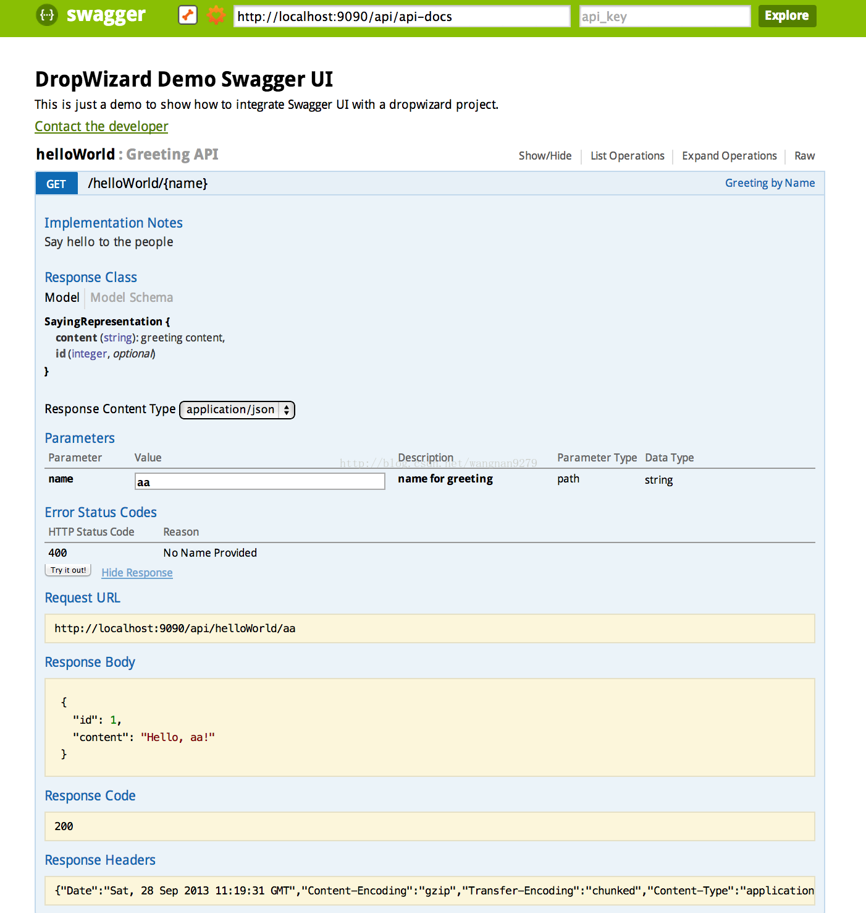

> Swagger 是一款RESTFUL接口的文档在线自动生成+功能测试功能软件。本文简单介绍了在项目中集成swagger的方法和一些常见问题。<!-- more --> 如果想深入分析项目源码，了解更多内容，见参考资料。Swagger 是一个规范和完整的框架，用于生成、描述、调用和可视化 RESTful 风格的 Web 服务。总体目标是使客户端和文件系统作为服务器以同样的速度来更新。文件的方法，参数和模型紧密集成到服务器端的代码，允许API来始终保持同步。Swagger 让部署管理和使用功能强大的API从未如此简单。


# 使用介绍
## 什么是swagger
Swagger™的目标是为REST APIs 定义一个标准的，与语言无关的接口，使人和计算机在看不到源码或者看不到文档或者不能通过网络流量检测的情况下能发现和理解各种服务的功能。当服务通过Swagger定义，消费者就能与远程的服务互动通过少量的实现逻辑。类似于低级编程接口，Swagger去掉了调用服务时的很多猜测。 浏览 Swagger-Spec 去了解更多关于Swagger 项目的信息，包括附加的支持其他语言的库。

## 如何集成Swagger-springmvc到我们的项目中?
### Maven
```xml
<dependency>
    <groupId>com.mangofactory</groupId>
    <artifactId>swagger-springmvc</artifactId>
    <version>0.9.4</version>
</dependency>
```
### Gradle

    repositories {
    jcenter()
    }
    compile "com.mangofactory:swagger-springmvc:0.9.4"
    
要最快捷地启动swagger-springmvc项目并且使用默认设置，推荐的方式是使用SwaggerSpringMvc插件

### Spring Java Configuration
```java
@Configuration
@EnableWebMvc
@EnableSwagger
@ComponentScan("com.myapp.packages")
public class WebAppConfig {
 ...
}
```

### Spring xml Configuration
```xml
<mvc:annotation-driven/> <!-- Required so swagger-springmvc can access spring's RequestMappingHandlerMapping  -->
<bean class="com.mangofactory.swagger.configuration.SpringSwaggerConfig" />
```

### SwaggerSpringMvcPlugin XML Configuration
为了使用这个插件，你需要创造一个spring Java配置类。使用spring的 @Configuration ，这个配置类必须被定义到你的xml上下文
```xml
<!-- Required so swagger-springmvc can access spring's RequestMappingHandlerMapping  -->
<mvc:annotation-driven/>
```

```java
bean class="com.yourapp.configuration.MySwaggerConfig"/>
@Configuration
@EnableSwagger //Loads the spring beans required by the framework
public class MySwaggerConfig {

private SpringSwaggerConfig springSwaggerConfig;

/**
* Required to autowire SpringSwaggerConfig
*/
@Autowired
public void setSpringSwaggerConfig(SpringSwaggerConfig springSwaggerConfig) {
  this.springSwaggerConfig = springSwaggerConfig;
}

/**
* Every SwaggerSpringMvcPlugin bean is picked up by the swagger-mvc framework - allowing for multiple
* swagger groups i.e. same code base multiple swagger resource listings.
 */
@Bean
public SwaggerSpringMvcPlugin customImplementation(){
  return new SwaggerSpringMvcPlugin(this.springSwaggerConfig)
          .includePatterns(".*pet.*");
}

}
```

### SwaggerSpringMvcPlugin Spring Java Configuration
使用@EnableSwagger注解 
自动注入SpringSwaggerConfig 
定义一个或多个SwaggerSpringMvcPlugin实例，通过springs @Bean注解

```java
@Configuration
@EnableWebMvc
@EnableSwagger
@ComponentScan("com.myapp.controllers")
public class CustomJavaPluginConfig {

private SpringSwaggerConfig springSwaggerConfig;

@Autowired
public void setSpringSwaggerConfig(SpringSwaggerConfig springSwaggerConfig) {
  this.springSwaggerConfig = springSwaggerConfig;
}

@Bean //Don't forget the @Bean annotation
public SwaggerSpringMvcPlugin customImplementation(){
  return new SwaggerSpringMvcPlugin(this.springSwaggerConfig)
        .apiInfo(apiInfo())
        .includePatterns(".*pet.*");
}

private ApiInfo apiInfo() {
  ApiInfo apiInfo = new ApiInfo(
          "My Apps API Title",
          "My Apps API Description",
          "My Apps API terms of service",
          "My Apps API Contact Email",
          "My Apps API Licence Type",
          "My Apps API License URL"
    );
  return apiInfo;
}
}
```

# 碰到的问题
## 关于@API注解
在Swagger Annotation中： 

API表示一个开放的API，可以通过description简要描述该API的功能。 
在一个@API下，可有多个@ApiOperation，表示针对该API的CRUD操作。在ApiOperation Annotation中可以通过value，notes描述该操作的作用，response描述正常情况下该请求的返回对象类型。 在一个ApiOperation下，可以通过ApiResponses描述该API操作可能出现的异常情况。 

ApiParam用于描述该API操作接受的参数类型
再接着，为项目的Model对象添加Swagger Annotation，这样Swagger Scanner可以获取更多关于Model对象的信息。

```java
@ApiModel(value = "A SayingRepresentation is a representation of greeting")
@JsonSerialize(include = JsonSerialize.Inclusion.NON_NULL)
public class SayingRepresentation {
private long id;
@ApiModelProperty(value = "greeting content", required = true)
private String content;

public SayingRepresentation(long id, String content) {
    this.id = id;
    this.content = content;
}

public long getId() {
    return id;
}

public String getContent() {
    return content;
}
```

通过上面的步骤，项目已经具备了提供Swagger格式的API信息的能力，接下来，我们把这些信息和Swagger UI集成，以非常美观，实用的方式把这些API信息展示出来。

##和Swagger UI的集成
首先，从github(https://github.com/wordnik/swagger-ui)上下载Swagger-UI, 把该项目dist目录下的内容拷贝到项目的resources的目录assets下。

然后，修改index.html, 把Swagger UI对象中的URL替换为自己的API路径。

      window.swaggerUi = new SwaggerUi({
      url: "/api/api-docs",
      dom_id: "swagger-ui-container",
      
最后，为了能访问到该页面，还需要在Service的Initialize方法中，添加AssetsBundle

```java
public void initialize(Bootstrap<HelloWorldConfiguration> bootstrap) {
    //指定配置文件的名字
    bootstrap.setName("helloWorld");
    bootstrap.addBundle(new AssetsBundle("/assets", "/", "index.html"));
}
```

最后的效果图： 



# 评价
Swagger可以充当前后端交流的重要桥梁，方便快捷。很实用。

Swagger项目允许你生产，显示和消费你自己的RESTful服务。不需要代理和第三方服务。是一个依赖自由的资源集合，它能通过Swagger API动态的生成漂亮的文档和沙盒,因为Swagger UI没有依赖，你可以把他部署到任何服务器环境或者是你自己的机器。

# 参考资料
官网：http://swagger.io/

GitHub：
swagger-springmvc:https://github.com/martypitt/swagger-springmvc

swagger-ui:https://github.com/swagger-api/swagger-ui

swagger-core:https://github.com/swagger-api/swagger-core

swagger-spec：https://github.com/swagger-api/swagger-spec